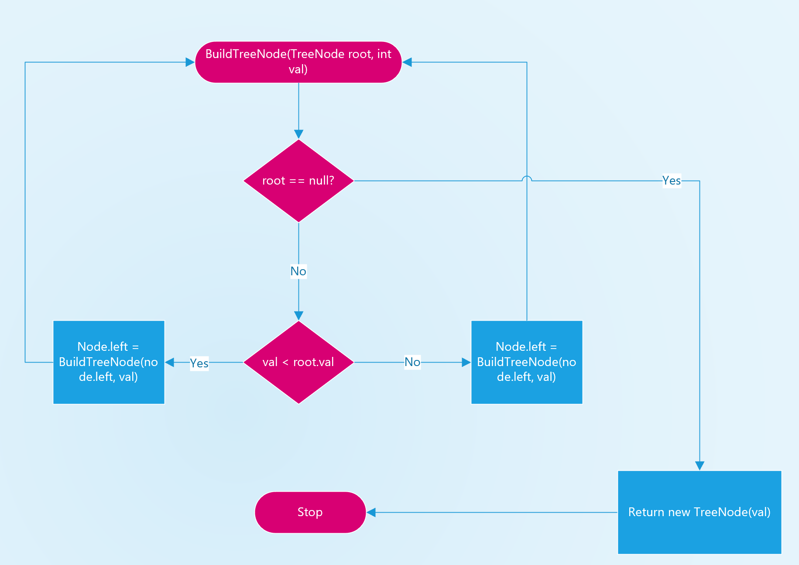

# [Medium][1008. Construct Binary Search Tree from Preorder Traversal](https://leetcode.com/problems/construct-binary-search-tree-from-preorder-traversal/)

Return the root node of a binary search tree that matches the given preorder traversal.

(Recall that a binary search tree is a binary tree where for every node, any descendant of node.left has a value < node.val, and any descendant of node.right has a value > node.val.  Also recall that a preorder traversal displays the value of the node first, then traverses node.left, then traverses node.right.)

Example 1:

```text
Input: [8,5,1,7,10,12]
Output: [8,5,10,1,7,null,12]
```


Note:

```text
1. 1 <= preorder.length <= 100
2. The values of preorder are distinct.
```

## 思路

这道题的要求是输入一棵树的先序遍历的结果，要求重新build这棵树。



时间复杂度: O(NlgN)
空间复杂度: O(N)

## 代码

```csharp
/**
 * Definition for a binary tree node.
 * public class TreeNode {
 *     public int val;
 *     public TreeNode left;
 *     public TreeNode right;
 *     public TreeNode(int x) { val = x; }
 * }
 */
public class Solution {
    public TreeNode BstFromPreorder(int[] preorder) {

        if(preorder?.Length == 0) return null;

        TreeNode root = null;

        for(int i = 0; i < preorder.Length; i++)
            root = BuildTreeNode(root, preorder[i]);
        return root;
    }

    private TreeNode BuildTreeNode(TreeNode root, int val)
    {
        if(root == null) return new TreeNode(val);

        if(val < root.val)
        {
            root.left = BuildTreeNode(root.left, val);
        }
        else
        {
            root.right = BuildTreeNode(root.right, val);
        }
        return root;
    }
}
```

## 思路 - 2

上面的递归采用了数个构建节点的方式，每次将单个节点从root下沉到合适的位置。但是这个方法的时间复杂度比较长，每次运算都要从头开始。为了优化，每次的运算从当前节点开始。
分析这个先序遍历的数组，第一个元素是根节点。第二个元素应该是根节点的子节点，但是不确定是是左还是右，确定的方法是看它比root大，还是小。但是到第三个元素的时候就更加复杂。有可能是第二个节点的子节点，也有可能是回到根节点。判断的依据是要再往上一个节点的值来看。
总结出来的规律是，当前是否插入一个节点，是由它是否处于一它的`lower`和`upper`之间.这个upper是由它的父节点来决定的。

1. 使用全局变量`int pos, int N, int[] preorder` 分别暂存当前数组的内容，已经当前已经滑过的节点。
2. 将根节点的`lower`和`upper`分别设置为`int.MinValue`和`int.MaxValue`.
3. 用递归的方式，将新的`lower`设置为`(int.MinValue, root.val)`，新的·设置为`(root.val, int.MaxValue)`,调用的时候将其返回结果分别赋值left和right上。
4. 如果新的val在llower和upper之间，则创建新的节点，并且pos移动到一个元素。否则直接返回null.
5. 结束条件是pos == N. 数组已经走到结尾。


时间复杂度: O(N)
空间复杂度: O(N)

## 代码 - 2

```csharp
public class Solution {
    private int pos = 0;
    private int[] preorder;
    private int N = 0;
    public TreeNode BstFromPreorder(int[] preorder) {
        if(preorder?.Length == 0) return null;

        this.pos = 0;
        this.N = preorder.Length;
        this.preorder = preorder;
        return BstFromPreorder(int.MinValue, int.MaxValue);
    }

    private TreeNode BstFromPreorder(int lower, int upper)
    {
        if(this.pos == N) return null;
        int val = preorder[pos];
        if(val < lower || val > upper) return null;
        pos++;
        TreeNode node = new TreeNode(val);
        node.left = BstFromPreorder(lower, val);
        node.right = BstFromPreorder(val, upper);
        return node;
    }
}
```
