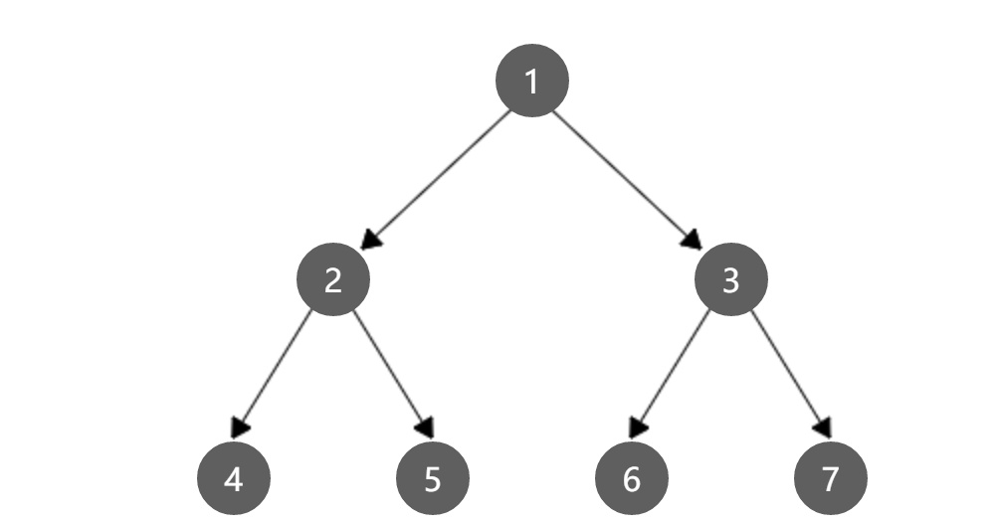

# [Medium][105. Construct Binary Tree from Preorder and Inorder Traversal](https://leetcode.com/problems/construct-binary-tree-from-preorder-and-inorder-traversal/)

Given preorder and inorder traversal of a tree, construct the binary tree.

**Note:**
You may assume that duplicates do not exist in the tree.

For example, given

> reorder = [3,9,20,15,7]
> inorder = [9,3,15,20,7]

Return the following binary tree:

```text
    3
   / \
  9  20
    /  \
   15   7
```

## 思路 - 递归

四种主要的遍历思想为：

> 前序遍历：根结点 ---> 左子树 ---> 右子树
> 中序遍历：左子树---> 根结点 ---> 右子树
> 后序遍历：左子树 ---> 右子树 ---> 根结点
> 层次遍历：只需按层次遍历即可

这里给出的的两个输入条件是前序遍历和中序遍历的结果。例如下面这棵树的 ：



前序遍历的结果是 : `[1,2,4,5,3,6,7]`
中序遍历的结果是 ：`[4,2,5,1,6,3,7]`

观察这个结果，前序遍历的结果中，root出现在第一个位置，所以可以用前序遍历的结果来确认root的位置。前序遍历的问题在于，下一个元素是左节点还是右节点无法确认。
这个时候观察中序遍历，可以只知道某个值是左节点还是右节点。

举例 ：

前序 ：`[1,2,X,X,X,X,X]`
中序 ：`[X,2,X,1,X,X,X]`

从前序中找到root `[1]`, 他的下一个节点是`[2]`, 可以确认`[2]`是`[1]`的子节点，但是不知道它是左还是右. 为了确认这一点，在中序中先找到`[1]`的位置，然后找`[2]`的位置。因为`[2]`是在`[1]`的左侧，所以是左节点。

前序 ：`[1,2,4,5,X,X,X]`
中序 ：`[4,2,5,1,X,X,X]`

假定现在已经走到前序的`[5]`这个元素，目前已经定位`[4]`是`[2]`的左节点，下一个`[5]`可能是`[4]`的子节点，也可以是`[2]`的右节点。为了确认这一点，先往中序中找`[4]`的位置，发现它的左侧已经出边界，所以`[5]`不是`[4]`的左节点，同时`[4]`的右侧是`[2]`，是他的父节点。回到`[2]`的位置，发现`[5]`存在于他的右侧，所以是他的右节点。

另在判断的时候，需要有边界值。要找某个节点的左节点，一点会在他的中序结果的左侧，同样，他的右节点一定是在他的右侧。如果在这个范围内没有找到这个值，说明它的左侧或者右侧是空，没有子节点。

```csharp
private TreeNode helper(int pInLeft, int pInRight)
{
    ...
    node.left = helper(pInLeft, pIn - 1);
    node.right = helper(pIn + 1, pInRight);
    ...
}
```

## 代码 - 递归

```csharp
/**
 * Definition for a binary tree node.
 * public class TreeNode {
 *     public int val;
 *     public TreeNode left;
 *     public TreeNode right;
 *     public TreeNode(int x) { val = x; }
 * }
 */
public class Solution {
    int[] preorder;
    int[] inorder;
    int pPre = 0;

    public TreeNode BuildTree(int[] preorder, int[] inorder)
    {
        this.preorder = preorder;
        this.inorder = inorder;
        this.pPre = 0;

        return helper(0, inorder.Length - 1);
    }

    private TreeNode helper(int pInLeft, int pInRight)
    {
        if (this.pPre > preorder.Length - 1)
            return null;

        int pIn = -1;
        int val = this.preorder[this.pPre];
        for (int i = pInLeft; i <= pInRight; i++)
        {
            if(this.inorder[i] == val)
            {
                pIn = i;
                this.pPre += 1;
                break;
            }
        }

        if (pIn == -1) return null;

        TreeNode node = new TreeNode(val);

        node.left = helper(pInLeft, pIn - 1);
        node.right = helper(pIn + 1, pInRight);

        return node;
    }
}
```
