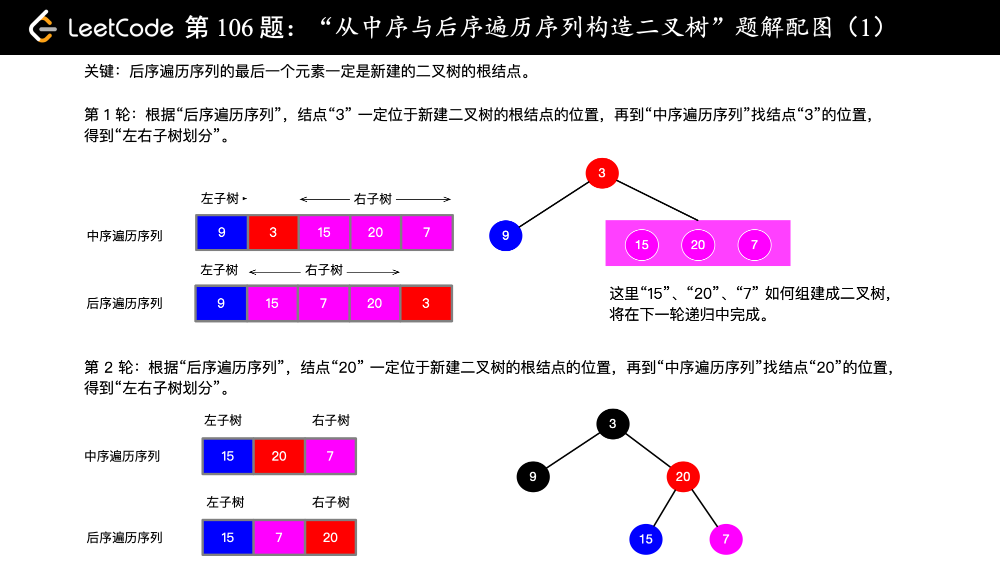

# [Medium][106. Construct Binary Tree from Inorder and Postorder Traversal](https://leetcode.com/problems/construct-binary-tree-from-inorder-and-postorder-traversal/)

Given inorder and postorder traversal of a tree, construct the binary tree.

**Note:**
You may assume that duplicates do not exist in the tree.

For example, given

inorder = [9,3,15,20,7]
postorder = [9,15,7,20,3]
Return the following binary tree:

```csharp
    3
   / \
  9  20
    /  \
   15   7
```

## 思路 - 后序遍历[递归]

这道题目跟[105. Construct Binary Tree from Preorder and Inorder Traversal](src/105.%20Construct%20Binary%20Tree%20from%20Preorder%20and%20Inorder%20Traversal)很类似。不同的地方在于这里给出的是中序遍历和后续遍历的结果。
同样可以使用中序遍历某个节点是在根节点的左边还是右边。
用后续遍历来确认根节点的位置。后续遍历的顺序是是左子树->右子树->根节点. 所有从postorder数组的最右侧开始遍历，先构造跟节点，然后下一个元素尝试构造右子树，接着是左子树。
构造过程中要判断这个元素是否在inorder的节点中找到，如果没有的话就返回Null.




## 代码 - 后序遍历[递归]

```csharp
/**
 * Definition for a binary tree node.
 * public class TreeNode {
 *     public int val;
 *     public TreeNode left;
 *     public TreeNode right;
 *     public TreeNode(int x) { val = x; }
 * }
 */
public class Solution {
    private int pos = 0;
    public TreeNode BuildTree(int[] inorder, int[] postorder)
    {

        pos = postorder.Length - 1;
        return BuildTree(inorder, postorder, 0, inorder.Length - 1);

    }

    private TreeNode BuildTree(int[] inorder, int[] postorder, int lo, int hi)
    {
        if (pos < 0 || lo > hi) return null;
        int mid = lo;
        int target = postorder[pos];
        TreeNode node = null;
        for (; mid <= hi; mid++)
        {
            if (inorder[mid] == target)
            {
                node = new TreeNode(target);
                pos--;
                break;
            }
        }
        if (node != null)
        {
            node.right = BuildTree(inorder, postorder, mid + 1, hi);
            node.left = BuildTree(inorder, postorder, lo, mid - 1);
        }
        return node;
    }
}
```
