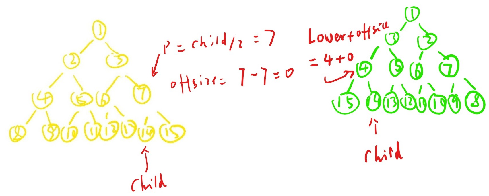

# 1104. Path In Zigzag Labelled Binary Tree

In an infinite binary tree where every node has two children, the nodes are labelled in row order.

In the odd numbered rows (ie., the first, third, fifth,...), the labelling is left to right, while in the even numbered rows (second, fourth, sixth,...), the labelling is right to left.


Given the label of a node in this tree, return the labels in the path from the root of the tree to the node with that label.

**Example 1:**

> Input: label = 14
> Output: [1,3,4,14]

**Example 2:**

> Input: label = 26
> Output: [1,2,6,10,26]

**Constraints:**

* 1 <= label <= 10^6

## 思路

这里的要求是，构建一个树，这个树每个节点的值从根节点开始以此+1.节点开始从右往左排，下一层则反向。最后给出一个label, 要求返回这个节点到根节点的路径上的值。

最暴力的算法，应该是构建一个完整的树，然后依次去找他的父节点到根节点为止。但是仔细一想，其实应该可以直接计算出每个父节点的值。
先观察一下一颗没有从左到右顺序布置的树。除了根节点之外，每一次会有一个最大值(Upper)和最小值(Lower)。数值是可以用 upper = Math.Pow(2,depth) - 1, Lower = Math.Pow(2, n - 1) 计算出来。给定一个label，就能计算出他在那一层。这种顺序配置的树，也就可以很快知道它的父节点所在的为止， parent = child / 2;


但是问题在于题设所给出的这种树，父节点发生了偏移。这种偏移可以需要通过计算重新定位父节点的值。
先按照 parent = child / 2 计算出没有变化的情况下，父节点应该所在的位置。这个位置计算出来之后，计算出它跟边界值Upper的偏移量。这个偏移量是不会改变的。题设给出的树，左右旋转过后，Upper和Lower所在的位置互换了。所以父节点的位置应该换算成Lower + Offsize. 这样就能计算出父节点的位置。



这样一直计算到根节点就能算出来整条路经了。

## 代码

```csharp
public class Solution {
    public IList<int> PathInZigZagTree(int label) {

        int depth = 0;
        for(int i = 1; i <= label; i *= 2 )
        {
            depth ++;
        }

        IList<int> ans = new List<int>(g);
        ans.Add(label);

        while(--depth > 0)
        {
            int offsize = Upper(depth) - label / 2;
            label = Lower(depth) + offsize;
            ans.Insert(0, label);
        }

        return ans;
    }

    private int Upper(int n)
    {
        return (int)Math.Pow(2,n) - 1;
    }

    private int Lower(int n)
    {
        return (int)Math.Pow(2, n - 1);
    }
}
```
