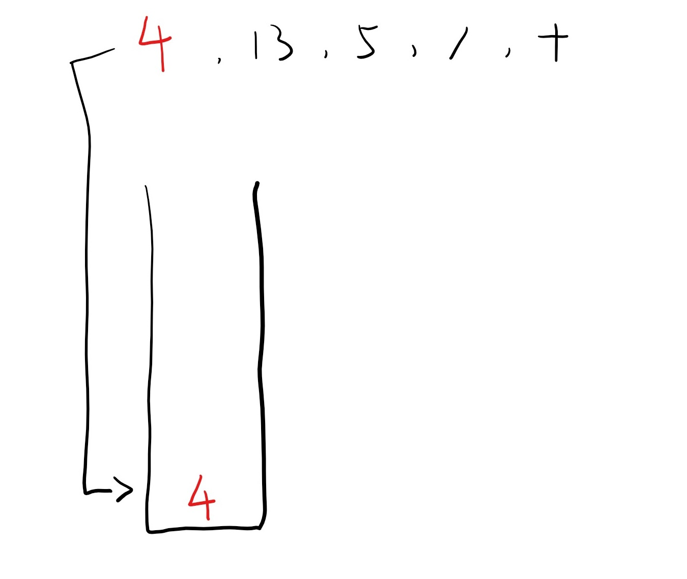
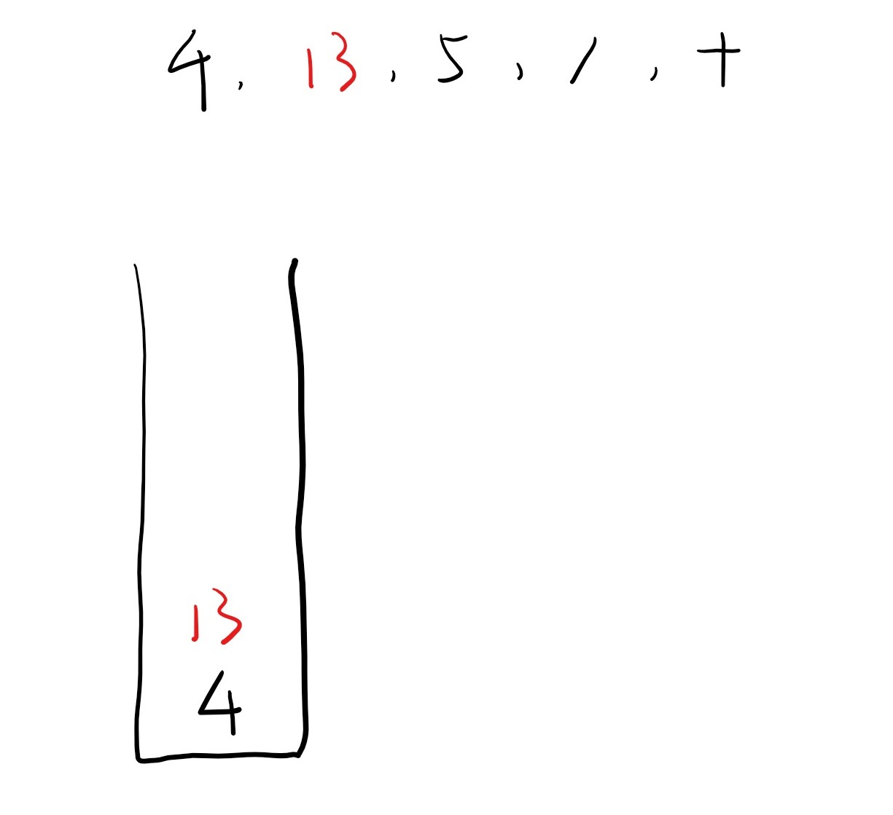
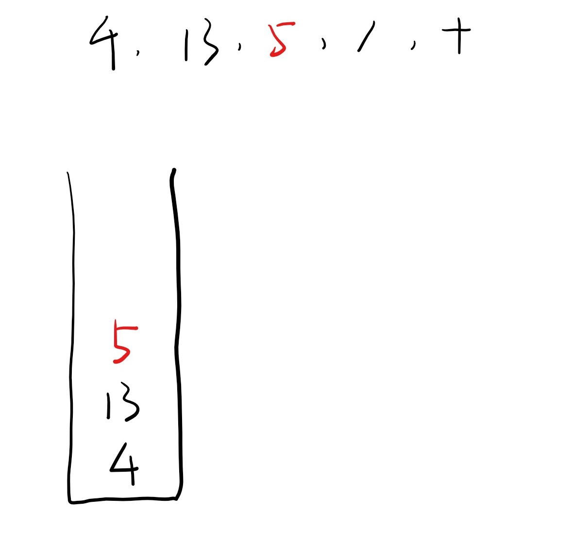
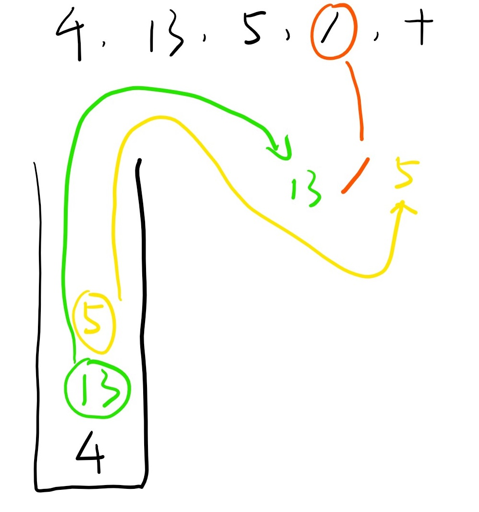
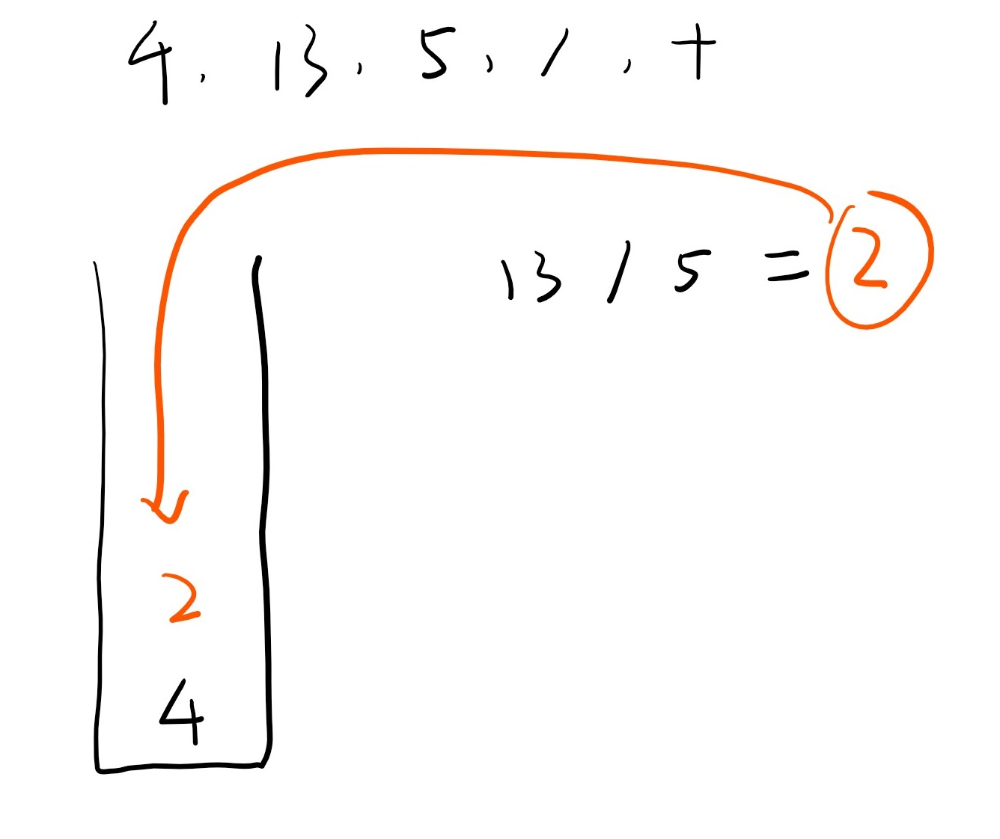
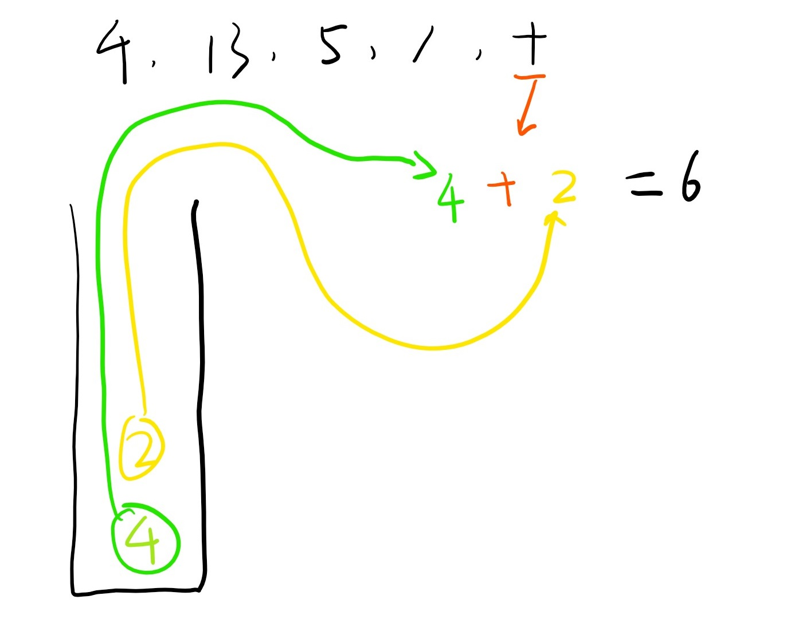

# [150. Evaluate Reverse Polish Notation](https://leetcode.com/problems/evaluate-reverse-polish-notation/)

Evaluate the value of an arithmetic expression in Reverse Polish Notation.

Valid operators are +, -, *, /. Each operand may be an integer or another expression.

Note:

* Division between two integers should truncate toward zero.
* The given RPN expression is always valid. That means the expression would always evaluate to a result and there won't be any divide by zero operation.

**Example 1:**

> Input: ["2", "1", "+", "3", "*"]
> Output: 9
> Explanation: ((2 + 1) * 3) = 9

**Example 2:**

> Input: ["4", "13", "5", "/", "+"]
> Output: 6
> Explanation: (4 + (13 / 5)) = 6

**Example 3:**

```text
Input: ["10", "6", "9", "3", "+", "-11", "*", "/", "*", "17", "+", "5", "+"]
Output: 22
Explanation:
  ((10 * (6 / ((9 + 3) * -11))) + 17) + 5
= ((10 * (6 / (12 * -11))) + 17) + 5
= ((10 * (6 / -132)) + 17) + 5
= ((10 * 0) + 17) + 5
= (0 + 17) + 5
= 17 + 5
= 22
```

## 思路 - [后缀表达式](https://baike.baidu.com/item/%E9%80%86%E6%B3%A2%E5%85%B0%E5%BC%8F/128437)

百度百科解释的还是蛮清楚的。逆波兰式是一种计算式的后缀表达式。例如人类可读的表达式为 a + b， 在逆波兰式中为 ab+.
逆波兰式的计算要借助一个辅助的Stack,当遇到的是一个数字，推入栈中。当遇到一个操作符的时候，需要将栈顶的2个数字Pop出来，作为算式的第二个和第一个operand。注意，栈顶位置的数字是第二个操作数，第二个数字是第一个操作数。例如 a+b,在栈中的位置是：

```text
|b|
---
|a|
---
|.|
|.|
---
```

举个例子，

> Input: ["4", "13", "5", "/", "+"]
> Output: 6
> Explanation: (4 + (13 / 5)) = 6

操作如下图：







## 代码 - 后缀表达式

```csharp
public class Solution {
    public int EvalRPN(string[] tokens)
    {
        Stack<int> q = new Stack<int>();
        for (int i = 0; i < tokens.Length; i++)
        {
            if (tokens[i] == "+" || tokens[i] == "-" || tokens[i] == "*" || tokens[i] == "/")
            {
                q.Push(operate(q.Pop(), tokens[i], q.Pop()));
            }
            else
                q.Push(int.Parse(tokens[i]));
        }
        return q.Pop();

    }

    private int operate(int op2, string symbol, int op1)
    {
        int ans = 0;
        switch (symbol)
        {
            case "+":
                ans = op1 + op2;
                break;
            case "-":
                ans = op1 - op2;
                break;
            case "*":
                ans = op1 * op2;
                break;
            case "/":
                ans = op1 / op2;
                break;
            default:
                break;
        }
        return ans;
    }
}
```
