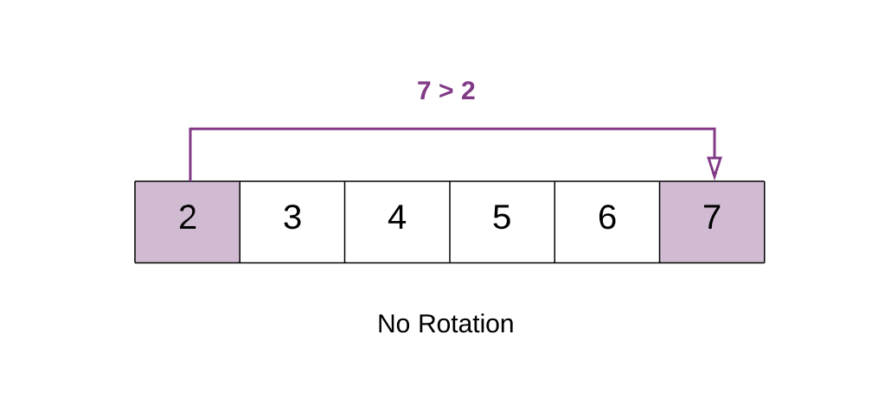
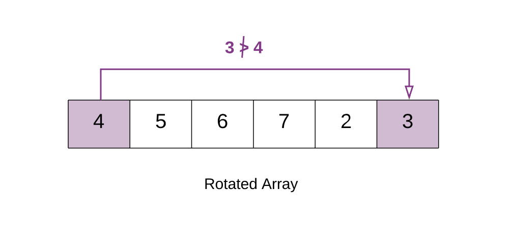

# [Medium][153. Find Minimum in Rotated Sorted Array](https://leetcode.com/problems/find-minimum-in-rotated-sorted-array/)

Suppose an array sorted in ascending order is rotated at some pivot unknown to you beforehand.

(i.e.,  [0,1,2,4,5,6,7] might become  [4,5,6,7,0,1,2]).

Find the minimum element.

You may assume no duplicate exists in the array.

**Example 1:**

> Input: [3,4,5,1,2]
> Output: 1

**Example 2:**

> Input: [4,5,6,7,0,1,2]
> Output: 0

## 思路 - 暴力破解

这道题目的题设是给定一个已经排序的升序数组，在某一点上发生了偏转。可知没有重复数，且偏转的点只有一个。那么可以得出一个结论，发生偏转的点存在一个特点是:`nums[i - 1] > nums[i]`. 最小的数出现在`nums[i]`的位置. 当然也有可能没有发生偏转，那么最小值在`nums[0]`. 采用遍历的方式判断这个偏转点的位置。

时间复杂度：O(N)
空间复杂度：O(1)

## 代码 - 暴力破解

```csharp
public class Solution {
    public int FindMin(int[] nums) {
        for(int i = 1; i < nums.Length; i++)
            if(nums[i - 1] > nums[i]) return nums[i];
        return nums[0];
    }
}
```

## 思路 - 二分法

还有一种方式是参考二分法，求中间位置`int mid = (l + r) / 2`的情况，将一个复杂的情况分解成小范围的子问题。
这个数组分为2种情况，偏转过和没有偏转过的情况。

1. 首先要确保循环继续的条件为`while(l < r)`。
2. 当找到最小值的时候存在2种情况：
   * mid 本身是最小值，那么他的左侧比他大。`if(mid > 0 && nums[mid - 1] > nums[mid]) return nums[mid];`
   * mid右边是最小值，那么mid的值比他右边的值大。`if(mid < nums.Length - 1 && nums[mid] > nums[mid + 1]) return nums[mid + 1];`
   * 上面2个条件不成立的时候，说明还没有接近最小值。
3. 没有发生过偏转的情况下，`nums[l] < nums[r]`, 最小值在左侧。可以之间返回最左侧的值。

4. 当出现的情况为左侧比右侧高的时候，情况就比较复杂。可以知道延某个点发生过偏转，需要找到这个点。这个时候要通过mid的位置来接近这个点。

5. 通过mid位置的值来确保一侧的数有序，避开min的点被排除的情况。
6. 

时间复杂度：O(logN)
空间复杂度：O(1)

## 代码 - 二分法

```csharp
public class Solution {
    public int FindMin(int[] nums) {

        int l = 0;
        int r = nums.Length - 1;
        while(l < r)
        {
            int mid = (r + l) / 2 ;
            if(mid < nums.Length - 1 && nums[mid] > nums[mid + 1]) return nums[mid + 1];
            if(mid > 0 && nums[mid - 1] > nums[mid]) return nums[mid];
            if(nums[l] < nums[r])
            {
                r = mid;
            }
            else
            {
                if(nums[l] < nums[mid])
                {
                    l = mid + 1;
                }
                else
                {
                    r = mid;
                }
            }
        }
        return nums[0];
    }
}
```
