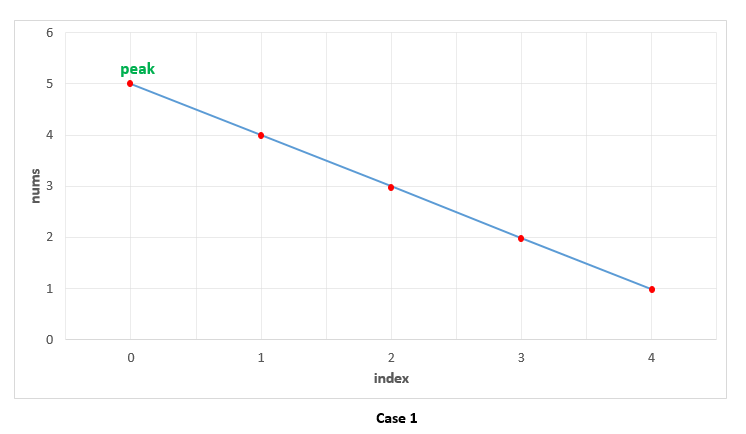
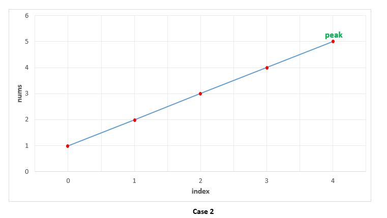
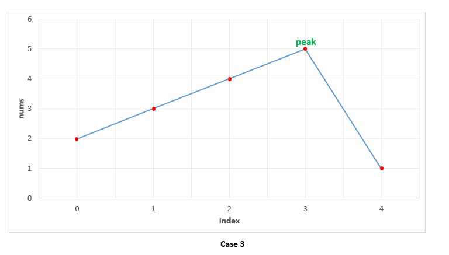

# 162. Find Peak Element

A peak element is an element that is greater than its neighbors.

Given an input array nums, where nums[i] ≠ nums[i+1], find a peak element and return its index.

The array may contain multiple peaks, in that case return the index to any one of the peaks is fine.

You may imagine that nums[-1] = nums[n] = -∞.

**Example 1:**

> Input: nums = [1,2,3,1]
> Output: 2
> Explanation: 3 is a peak element and your function should return the index number 2.

**Example 2:**

> Input: nums = [1,2,1,3,5,6,4]
> Output: 1 or 5
> Explanation: Your function can return either index number 1 where the peak element is 2, or index number 5 where the peak element is 6.

**Note:**

Your solution should be in logarithmic complexity.

## 思路 - O(N)

这道题的峰值是要找到一个比两侧数组都大的数字。考虑到题设是左侧是负无穷大，所以左半侧是上升的已经可以肯定了，只要找到一个右侧是下降的就结束。所以遍历一遍就可以了 ┑(￣Д ￣)┍
然后没这么简单 ...

## 代码 - O(N)

```csharp
public class Solution {
    public int FindPeakElement(int[] nums) {
        if(nums == null || nums.Length <= 1) return 0;

        for(int i = 0; i < nums.Length - 1; i++)
            if(nums[i] > nums[i+1])
                return i;
        return nums.Length - 1;
    }
}
```

## 思路 - O(logN)

之所以没这么简单，是还有一个要求`Your solution should be in logarithmic complexity.`这里要求是对数级别的时间复杂度。既然是对数级别，那么自然是想到了二分法。
观察一下找峰值的时候的一些可能情况。

情况 1 ： peak在最左侧.这种情形下，先找到中间的位置 mid = (left + right) / 2. 然后比较 mid + 1的位置，右侧位置比mid的值要小，说明peak应该出现在他的左侧。这样将right移动到mid所在的位置，重新计算一次。直到left 和 right相遇。那么left就是peak的位置。
这里 `right = mid`，而不是 `right = mid - 1`的原因。因为Peak的位置，`nums[left] < nums[mid] < nums[right]`，所以不能超过mid。



情况 2 ： peak在最右端。这种情形下，先找到中间的位置 mid = (left + right) / 2. 然后比较 mid + 1的位置，右侧位置比mid的值要大，说明peak出现在更右边的位置，将left移动到mid + 1所在的位置。因为计算mid的时候是`mid = (left + right) /2`, 考虑到这种计算方式，mid事实上是偏left的。例如， left = 0， right = 1, mid = (0 + 1) /2 = 0. Left = mid + 1不会出现漏掉 peak的情况。要出现 left = mid + 1漏掉peak的情况，必须mid是peak本身。但是如果如此的话，上面  `nums[mid] < nums[right]` 的条件会先触发，那么移动的应该是right, 而不是left. Left存在着可能性peak在left位置上，这个时候，left是不会向右移动的, 而是right向左移动。


情况 3 : Peak在中间的某个端点上。那么就是上面2种情况的综合。如果`nums[mid] < nums[right]`,, 那么移动right, 使其`right = mid`.  如果`nums[mid] > nums[right]`, 则是`left = mid + 1`


## 代码 - O(logN)

```csharp
public class Solution {
    public int FindPeakElement(int[] nums) {

        if(nums == null || nums.Length <= 1) return 0;

        int left = 0;
        int right = nums.Length - 1;

        while(left < right)
        {
            int mid = left + (right - left) / 2;
            if(nums[mid] > nums[mid + 1])
            {
                right = mid;
            }
            else if(nums[mid] < nums[mid + 1])
            {
                left = mid + 1;
            }
        }

        return left;

    }
}
```
