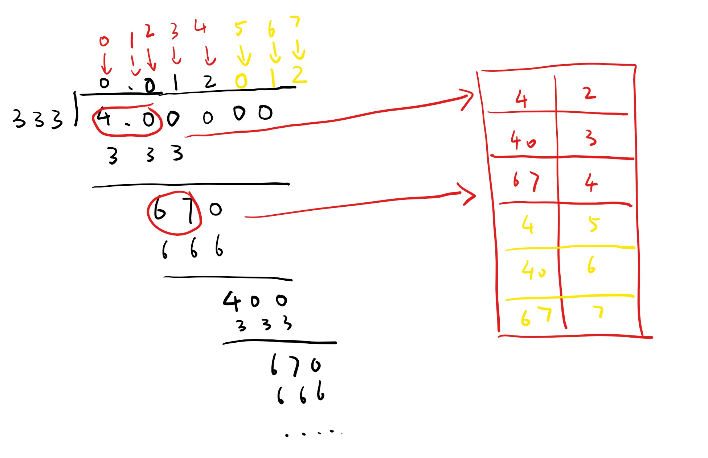

# [166. Fraction to Recurring Decimal](https://leetcode.com/problems/fraction-to-recurring-decimal/)

Given two integers representing the numerator and denominator of a fraction, return the fraction in string format.

If the fractional part is repeating, enclose the repeating part in parentheses.

**Example 1:**

> Input: numerator = 1, denominator = 2
> Output: "0.5"

**Example 2:**

> Input: numerator = 2, denominator = 1
> Output: "2"

**Example 3:**

> Input: numerator = 2, denominator = 3
> Output: "0.(6)"

## 思路 - 长除法

这题的要求是计算除法，可以模拟笔算的时候，我们做除法的方式，即长除法。



以`4/333`为例。当大于1时，直接用 `/` 取得左边的商和余。小于1的部分，在小数点后面不停的添加0，并且做除法，同时求出新的余。
终止的条件是全部除完，即余为0。或者进入一个循环。循环的的出现是在于是否有重复的余出现过。例如4/333， 一开始计算的时候出现过的余分别为`4，40，67`.随着计算的进行，会重复出现这个组合`4，40，67`.所以需要用一个字典表保存曾经出现过的余，一旦有重复的余出现，就表示会进入一个循环。

这里会遇到的问题主要是 ：

1. 数据溢出。 用int做除法有存在溢出的可能性。为了解决这个问题可以采用`decimal`.
2. 正负数。做余的时候要考虑'+/-', 为了简单化逻辑，开始的时候就判断最终的输出结果是正还是负，然后全部转换成正数。这个步骤正如手算的时候所作的一样。

## 代码 - 长除法

```csharp
public class Solution {
    public string FractionToDecimal(int numerator, int denominator)
    {
        decimal num = numerator;
        decimal den = denominator;

        if (num == 0) return "0";
        if (den == 1) return (num).ToString();
        if (den == -1) return (-num).ToString();

        StringBuilder ans = new StringBuilder();

        if (num > 0 ^ den > 0) ans.Append("-");
        num = num < 0 ? -num : num;
        den = den < 0 ? -den : den;


        int quotient = Divide(num, den);
        decimal reminder = num % den;

        ans.Append(quotient);
        if (reminder != 0)
        {
            ans.Append('.');

            Dictionary<decimal, int> rder = new Dictionary<decimal, int>();

            while (reminder != 0)
            {
                if (rder.ContainsKey(reminder))
                {
                    ans.Insert(rder[reminder], '(');
                    ans.Append(')');
                    break;
                }
                rder.Add(reminder, ans.Length);

                reminder *= 10;
                quotient = Divide(reminder, den);
                reminder %= den;
                ans.Append(quotient);
            }
        }
        return ans.ToString();
    }
    private int Divide(decimal numerator, decimal denominator)
    {
        return (int)Math.Floor(numerator / denominator);
    }
}
```
