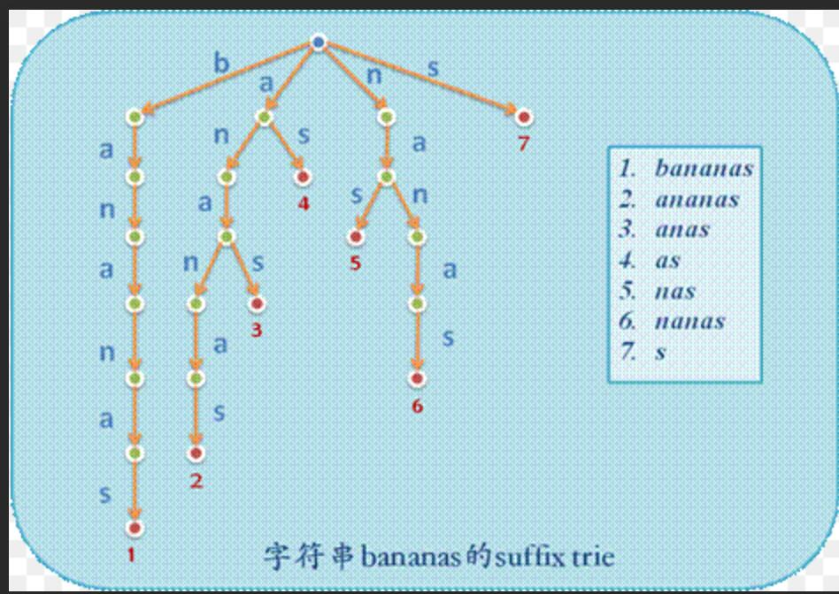

# [Medium] [208. Implement Trie (Prefix Tree)](https://leetcode.com/problems/implement-trie-prefix-tree/)

Implement a trie with insert, search, and startsWith methods.

**Example:**

```csharp
Trie trie = new Trie();

trie.insert("apple");
trie.search("apple");   // returns true
trie.search("app");     // returns false
trie.startsWith("app"); // returns true
trie.insert("app");
trie.search("app");     // returns true
```

**Note:**

You may assume that all inputs are consist of lowercase letters a-z.
All inputs are guaranteed to be non-empty strings.

## 思路 - Trie

Trie 树，也叫“字典树”。顾名思义，它是一个树形结构。它是一种专门处理字符串匹配的数据结构，用来解决在一组字符串集合中快速查找某个字符串的问题。此外 Trie 树也称前缀树（因为某节点的后代存在共同的前缀，比如pan是panda的前缀）。它的key都为字符串，能做到高效查询和插入，时间复杂度为O(k)，k为字符串长度，缺点是如果大量字符串没有共同前缀时很耗内存。

它的核心思想就是通过最大限度地减少无谓的字符串比较，使得查询高效率，即「用空间换时间」，再利用共同前缀来提高查询效率。

Trie树 的三个特点：

1. 根节点不包含字符，除根节点外每一个节点都只包含一个字符
2. 从根节点到某一节点，路径上经过的字符连接起来，为该节点对应的字符串
3. 每个节点的所有子节点包含的字符都不相同

在构造过程中的每一步，都相当于往 Trie 树中插入一个字符串。当所有字符串都插入完成之后，Trie 树就构造好了。



在构建这个Trie树的过程中，因为题设只要求输入26个小写字母，所以设定每个Node下面有一个大小为26的数组来记录下面那个字典有值。用`node.nodes[word[i] - 'a']`来对其进行赋值和取值。

因为字典都是记录一个个的字母，所以要用`IsEnd`来确定是否是一个单词的结尾。

## 代码

```csharp
public class Trie
{

    /** Initialize your data structure here. */

    private Trie[] nodes;
    private int capacity = 26;
    private bool IsEnd = false;
    public Trie()
    {
        nodes = new Trie[capacity];
        IsEnd = false;
    }

    /** Inserts a word into the trie. */
    public void Insert(string word)
    {
        Trie node = this;
        for (int i = 0; i < word.Length; i++)
        {
            if(node.nodes[word[i] - 'a'] == null)
                node.nodes[word[i] - 'a'] = new Trie();
            node = node.nodes[word[i] - 'a'];
        }
        node.IsEnd = true;
    }


    /** Returns if the word is in the trie. */
    public bool Search(string word)
    {
        Trie node = this;
        for (int i = 0; i < word.Length; i++)
        {
            node = node.nodes[word[i] - 'a'];
            if (node == null) return false;
        }
        return node.IsEnd;
    }


    /** Returns if there is any word in the trie that starts with the given prefix. */
    public bool StartsWith(string prefix)
    {
        Trie node = this;
        for (int i = 0; i < prefix.Length; i++)
        {
            node = node.nodes[prefix[i] - 'a'];
            if (node == null) return false;
        }
        return true;
    }
}


/**
 * Your Trie object will be instantiated and called as such:
 * Trie obj = new Trie();
 * obj.Insert(word);
 * bool param_2 = obj.Search(word);
 * bool param_3 = obj.StartsWith(prefix);
 */
 ```
