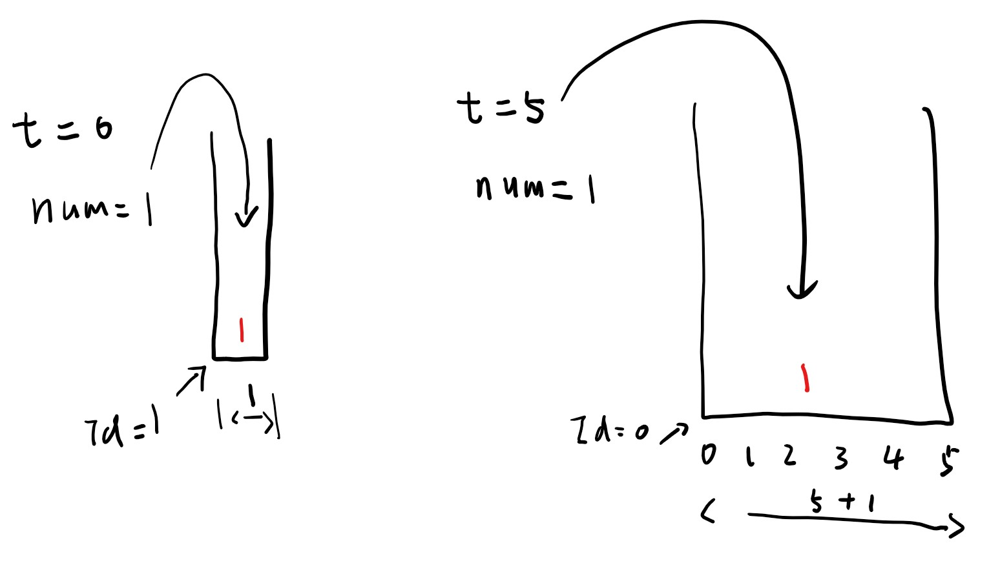
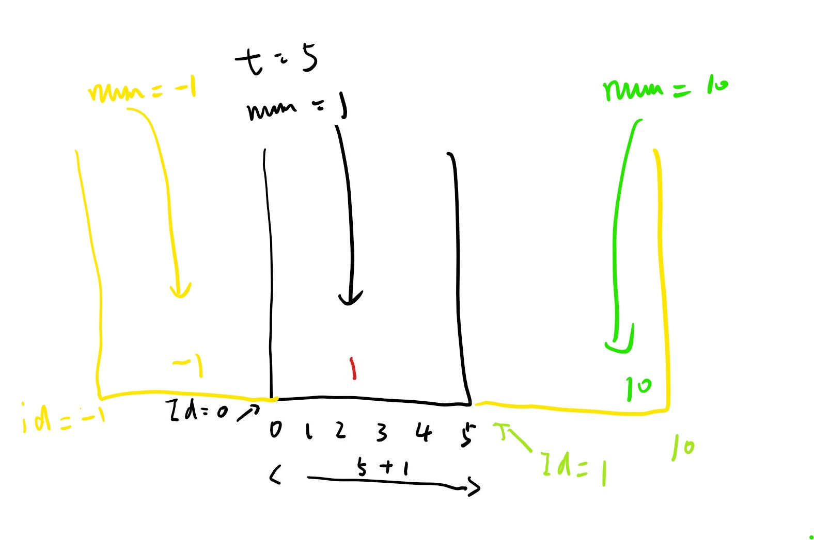

# [220. Contains Duplicate III](https://leetcode-cn.com/problems/contains-duplicate-iii/)

Given an array of integers, find out whether there are two distinct indices i and j in the array such that the absolute difference between nums[i] and nums[j] is at most t and the absolute difference between i and j is at most k.

Example 1:

> Input: nums = [1,2,3,1], k = 3, t = 0
> Output: true

Example 2:

> Input: nums = [1,0,1,1], k = 1, t = 2
> Output: true

Example 3:

> Input: nums = [1,5,9,1,5,9], k = 2, t = 3
> Output: false

## 思路 - 暴力破解

给出一个数组，搜索数组中是存在这样的情况:

* j - i <= k
* Math.Abs(nums[i] - nums[j]) <= t

即，给定一个互动窗口的范围 `j - i <= k`， 这个滑动窗口内任意2个值的差值<= t, 那么返回true, 否则就是false.

nums[i] - nums[j]的时候，有可能输入值包含了int.MaxValue或者 int.MinValue的情况。为了不让数据溢出，使用double类型。 `Math.Abs((double)nums[i] - (double)nums[j]`。

时间复杂度为 O(n * min(n,k)). 整个`int[]`会遍历一遍，在滑动窗口有第二层循环。
空间复杂度O(1), 没有借助额外的存储空间。

## 代码 - 暴力破解

```csharp
public class Solution {
    public bool ContainsNearbyAlmostDuplicate(int[] nums, int k, int t)
    {
        for (int i = 0; i < nums.Length; ++i)
        {
            for (int j = Math.Max(i - k, 0); j < i; ++j)
            {
                if (Math.Abs((double)nums[i] - (double)nums[j]) <= t) return true;
            }
        }
        return false;
    }
}
```

## 思路 - 桶排序

上面的思路是利用了滑动窗口。滑动窗口内的循环导致了时间复杂度达到了`O(n * min(n, k))`. 如果能降低滑动窗口内的计算次数，有机会将时间复杂度降低到`O(n)`.
为了解决这个问题，可以借鉴桶排序。将`num[i]`装到一个小范围的bukect里面。bucket范围的确定，**这个bucket的范围由t + 1来决定**。为什么是t + 1. 因为 t 是2个数的差值。如果`t = 0` ，说明要求是无差值，两个数要相等。那么这个bucket的范围就是1. 如果 `t = 1`, bucket应该能装下2个数，左边界和有边界之差应该是1.

维持一个Dictionary用来保存，使用Bucket的ID作为key. Bucket的起始值作为它的ID，它的范围可以用ID + t 快速的界定出来。这个ID的计算可以用 val / (t + 1) 得出来。 例如 nums[i] = 5, t = 4。 Bucket的起始位置在 0， 可以用 0作为它的 ID。下一个bucket的起始位置在1, 也就是当前这个bucket的结束位置。



**为负数的bucket**. 上面的情况是`nums[i] >= 0`的情况。如果为负数的情况需要将ID往左侧挪1.这是为了解决 `(-1)/5 = -0 = 0`的情况，所以整体往左侧移动1.



确定了bucket的范围，下一步是要设计如何确认2个数的差值是否为t。这里分几种情况。

1. 如果2个数差的很远，他们所在的bucket也很远，可以无视。
2. 如果一个bucket里面已经存在一个数，再往这个bucket里面放另外一个数的时候，这两个数必然小于小于k. 返回true.
3. 

## 代码 - 桶排序

```csharp
public class Solution {
    public bool ContainsNearbyAlmostDuplicate(int[] nums, int k, int t)
    {
        if (k == 0 || t < 0) return false;

        Dictionary<int, double> bucket = new Dictionary<int, double>();

        for (int i = 0; i < nums.Length; i++)
        {
            int id = GetBucketId(nums[i], t);

            if (bucket.ContainsKey(id))
                return true;
            if (bucket.ContainsKey(id - 1) && Math.Abs(nums[i] - bucket[id - 1]) <= t )
                return true;
            if (bucket.ContainsKey(id + 1) && Math.Abs(bucket[id + 1] - nums[i]) <= t)
                return true;

            bucket.Add(id, nums[i]);

            if(i >= k)
                bucket.Remove(GetBucketId(nums[i - k], t));
        }

        return false;
    }

    private int GetBucketId(int val, int t)
    {
        double id = (double)val / ((double)t + 1);
        id = id < 0 ? id - 1 : id;
        return (int)id;
    }
}
```
