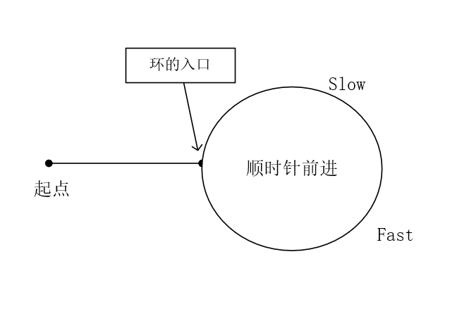

# [Medium][287. Find the Duplicate Number](https://leetcode.com/problems/find-the-duplicate-number/)

Given an array nums containing n + 1 integers where each integer is between 1 and n (inclusive), prove that at least one duplicate number must exist. Assume that there is only one duplicate number, find the duplicate one.

**Example 1:**

> Input: [1,3,4,2,2]
> Output: 2

**Example 2:**

> Input: [3,1,3,4,2]
> Output: 3

**Note:**

> You must not modify the array (assume the array is read only).
> You must use only constant, O(1) extra space.
> Your runtime complexity should be less than O(n2).
> There is only one duplicate number in the array, but it could be repeated more than once.

## 思路 - 1

先将这个数组排序，如果有重复数字，必然存在`nums[i-1] == nums[i]`.

时间复杂度： O(NlgN). 假设排序是用了O(NlgN), 再对数组进行遍历为O(N)，总时间复杂度为O(NlgN + N) = O(NlgN)
空间复杂度： O(1)

但是这个算法的问题在于改变了数组的内容，所以并不符合要求。

## 代码 - 1

```csharp
public class Solution {
    public int FindDuplicate(int[] nums) {
        Array.Sort(nums);
        for(int i = 1; i < nums.Length; i++)
            if(nums[i - 1] == nums[i]) return nums[i];
        return -1;
    }
}
```

## 思路 - 2

用一个`List<int>` 记录以及访问过的元素。

算法复杂度： O(N)
空间复杂度： O(N)

空间复杂度超标了。

## 代码 - 2

```csharp
public class Solution {
    public int FindDuplicate(int[] nums) {
        IList<int> cache = new List<int>();
        for(int i = 0; i < nums.Length; i++)
        {
            if(cache.Contains(nums[i]))
                return nums[i];
            cache.Add(nums[i]);
        }

        return -1;
    }
}
```

## 思路 - 循环检测

题目的设定，一个长度为n+1的数组，里面包含了1 - n的数字，并且保证至少有一个重复的数字。由题设可以得出一些推论,即对于每对索引 `i` 和值 `nums[i]` 而言，指向了下一个元素的索引`j`。由于必然存在至少一个重复的数字，这样一来就变成了一个循环检查的问题。



先做一个快慢指针，让两个指针在循环内相遇。用快慢指针是比较常用的检测是否有闭环的方法。类似于求最小公约数的思路。

```csharp
int p1 = 0, p2 = 0;
do
{
    p1 = nums[p1];
    p2 = nums[nums[p2]];

}while(p1 != p2);
```

一旦p1 == p2，就能证明有闭环。其实题设也给出了闭环的设定，否则上面的算法就会出现死循环出不来。但是p1和p2相遇的点只能证明他们在环内。要求返还的值，其实是环的入口。如何求环的入口？

由于p1 和 p2是快慢指针的关系，p1 和 p2在重合的时候走过的距离分别是n步和2n步。在重合的一瞬间，从0点的位置重新再释放一个指针p3，用单步的方式往前走，再p3和之前的慢指针p1重合的时候，同样有p1走过2n步，而p3走过n步的情况，又完成了快慢指针的一个相同周期。这个时候重合的点再环的入口处。
代码实现的时候，由于快指针这个时候已经启用了，所以不需要申明p3，直接使用p2来代替就好了。

```csharp
p2 = 0;
while(p1 != p2)
{
    p1 = nums[p1];
    p2 = nums[p2];
}
```

时间复杂度: O(N), 虽然环内的节点可能会被多次访问，但是相当于求环内的最小公约数，复杂度为O(n), 环外的节点访问了2-3次，快指针，慢指针和p3.O(2.5), 所以为O(N).

空间复杂度：O(1)。

参考 ： [快慢指针的解释](https://leetcode-cn.com/problems/find-the-duplicate-number/solution/kuai-man-zhi-zhen-de-jie-shi-cong-damien_undoxie-d/)

## 代码 - 循环检测

```csharp
public class Solution {
    public int FindDuplicate(int[] nums) {
        int p1 = 0, p2 = 0;
        do
        {
            p1 = nums[p1];
            p2 = nums[nums[p2]];

        }while(p1 != p2);

        p2 = 0;
        while(p1 != p2)
        {
            p1 = nums[p1];
            p2 = nums[p2];
        }

        return p1;
    }
}
```
