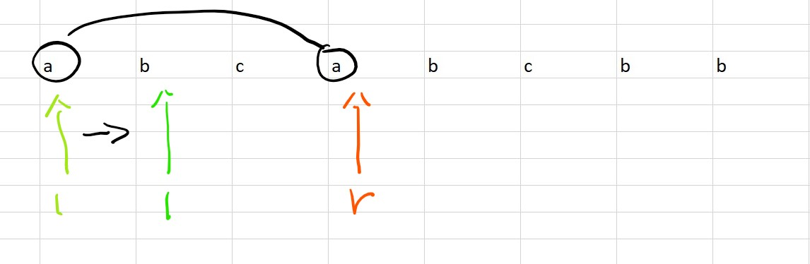
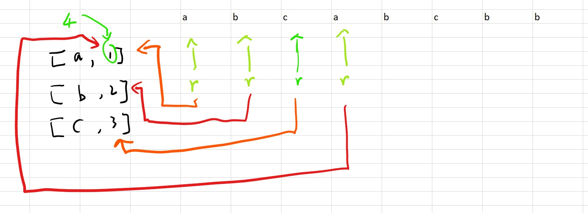
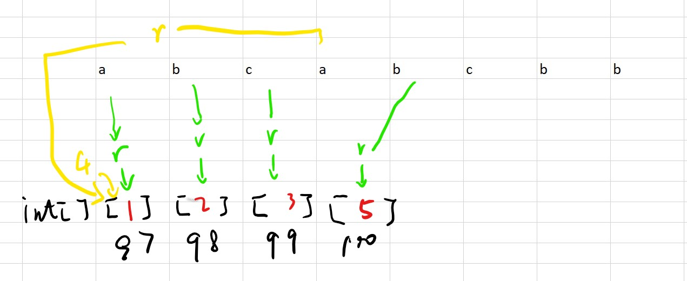

# [Medium][3. Longest Substring Without Repeating Characters](https://leetcode.com/problems/longest-substring-without-repeating-characters/)

Given a string, find the length of the longest substring without repeating characters.

Example 1:

```text
Input: "abcabcbb"
Output: 3
Explanation: The answer is "abc", with the length of 3.
```

Example 2:

```text
Input: "bbbbb"
Output: 1
Explanation: The answer is "b", with the length of 1.
```

Example 3:

```text
Input: "pwwkew"
Output: 3
Explanation: The answer is "wke", with the length of 3.
             Note that the answer must be a substring, "pwke" is a subsequence and not a substring.
```

## 思路 - 暴力破解

这个是效率比较差的方法，从左边开始扫描数组，将已经扫描过的char放到一个List中，往右移动的时候检查是否已经被记录过。如果没有则继续。如果已经过，截断子串，左边的指针往右移动一个。

时间复杂度：O(N^2)
空间复杂度：O(N)

## 代码 - Brute Force

```csharp
public class Solution {
    public int LengthOfLongestSubstring(string s) {
        int max = 0;
        int len = 0;
        char[] ch = s.ToCharArray();

        for(int i = 0; i < ch.Length; i++)
        {
            max = Math.Max(max,  LenghtOfLongest(ch, i));
        }
        return max;
    }

    private int LenghtOfLongest(char[] ch, int pos)
    {
        List<char> recorder = new List<char>();
        recorder.Add(ch[pos]);
        for(int i = pos + 1; i < ch.Length; i++)
        {
            if(recorder.Contains(ch[i])) break;
            recorder.Add(ch[i]);
        }
        return recorder.Count;
    }
}
```

## 思路 - sliding window

同样需要记录已经读取过的char，记录遍历过的char。

1. 如果没有遇到重复的char的时候，将char放入到Dictionary中，r向右走一格。
2. 当遇到重复的char的时候，并不需要将右侧的指针移动到最左端。因为已经验证过移动过的char内没有重复的char，所有只需要将左侧的指针向右移动一格，并且将左侧的char从`Dictioary`中去掉。去掉左侧这个char并不丢字符。因为r这个时候正指向一个重复的字符，而且关键点在于r并不会移动。在下一轮执行的时候，因为r指向的char没有重复，所有会重新加入到Dictionary里面。
3. 然后继续进行比较即可。当右侧指针走完整个数组即完成。

时间复杂度：O(N). 用右侧的指针遍历数组为O(N),出现重复的时候，左侧指针会移动并且访问下一个元素。所以最坏的情况下是每个元素被访问2次，O(2N) = O(N).
空间复杂度：O(N).利用了`List<char>`.

## 代码 - sliding window

```csharp
public class Solution {
    public int LengthOfLongestSubstring(string s) {
        int ans = 0;
        List<char> memo = new List<char>();

        for(int l = 0, r = 0; r < s.Length;)
        {
            if(memo.Contains(s[r]))
            {
                memo.Remove(s[l++]);
            }
            else
            {
                memo.Add(s[r++]);
                ans = Math.Max(ans, r - l);
            }
        }
        return ans;
    }
}
```

## 思路 - 优化 sliding window

sliding window的方式还有可以改进的空间。当遇到重复的字符的时候，l并不需要一步一步的增加。而是可以一次跳到重复的字符所在位置的+1.



但是也要注意，`l`要处于他能跳到的最远处。举个例子，如`abcbac`. 当r处于位置`s[3] == b`的时候，出现了重复的字符`b`, `l`要指向第一个`b`后面的位置`2`. 下一步`r++`之后，指向了`s[4] == a`, 又出现了重复的字符`a`. 这个时候`a`所在的位置要比之前`b`所在的位置靠左。这种情况下，'l'不能指向`a`所在的位置+1， 这样会造成`l`的左移，导致最后的结果出错。这里就是一个要避免的陷阱。为了避免这个陷阱`l`的复制规则为`l = Math.Max(memo[s[r]), l);`.

返回值ans的计算则是根据`l`和`r`所在的位置得到 `ans = Math.Max(ans, r - l + 1);`.

如何记录重复字符所出现的位置，可以使用一个Dictionary来记录字符出现时候，r所在的位置。因为需要l移动到重复字符的下一个位置，所以要存储的位置是r+1.



如果是为了记录字符所在的位置。比Dictionary更加高效的方式是可以用一个int数组。用一个int[128]来对应字符的ASCII码。



时间复杂度：O(N).
空间复杂度：O(N).

## 代码 - sliding window [Dictionary]

```csharp
public class Solution {
    public int LengthOfLongestSubstring(string s) {
        int ans = 0;
        Dictionary<char, int> memo = new Dictionary<char, int>();

        for(int l = 0, r = 0; r < s.Length; r++)
        {
            if(memo.ContainsKey(s[r]))
            {
                l = Math.Max(l, memo[s[r]]);
            }
            memo[s[r]] = r + 1;
            ans = Math.Max(ans, r - l + 1);
        }
        return ans;
    }
}
```

## 代码 - sliding window [int arrar]

```csharp
public class Solution {
    public int LengthOfLongestSubstring(string s)
    {
        int max = 0;

        char[] ch = s.ToCharArray();
        int[] index = new int[128];


        for(int l = 0, r = 0; r < s.Length; r++)
        {

            l = l > index[ch[r]] ? l : index[ch[r]];
            max = max > r - l + 1 ? max : r - l + 1;
            index[ch[r]] = r + 1;

        }

        return max;
    }
}
```
