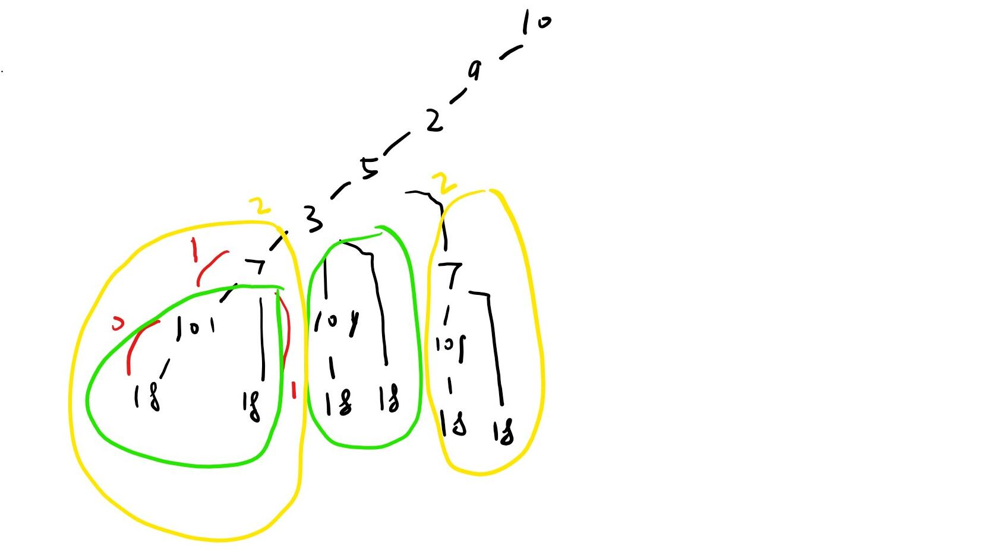

# [Medium][300. Longest Increasing Subsequence](https://leetcode.com/problems/longest-increasing-subsequence/)

Given an unsorted array of integers, find the length of longest increasing subsequence.

**Example:**

Input: [10,9,2,5,3,7,101,18]
Output: 4
Explanation: The longest increasing subsequence is [2,3,7,101], therefore the length is 4.
Note:

There may be more than one LIS combination, it is only necessary for you to return the length.
Your algorithm should run in O(n2) complexity.
Follow up: Could you improve it to O(n log n) time complexity?

## 思路 - DP - 最优子结构

这里的题目要求返回最长的升序数列的长度。中间如果有反序的情况，可以略过，继续计算后面的升序数列长度。例如题目里面的例子`[2,5,3,7,101]` 中`[5,3]`已经不再是升序，所有5被排除，但没有影响后面的`[3,7,101]`的统计。后面一个数字是否是升序，跟前面的数字的选取有关系。这种情况下，使用DP会比较合适。

在计算10作为起点的时候，比较`[9,2,5,3,7,101,18]`中只有比10大的数字才能作为下一个比较数字的起点。这里[101]和[18]都比10大，形成了2个分支。不过幸亏已经结束了，所有很容易计算出来最长Length是2，[10,101]或者[10,18].
[2]就没这么幸运了，后面的[5,3,7,101,18]都比2大，都可以作为下一个数字的起点，这里出现5个分支需要检查。运算量就很大了。

不过可以注意到，约靠近右侧，最长升序数组长度非常容易确定。往左侧移动的时候，当前这个节点与最长的升序数组相连，就会得到当前这个节点的最长升序数组长度。这是最优子结构的思路。

先走到数组最右侧`[18]`，由于右侧没有元素，所有长度是1，然后往左移动一位到[101]，这个位置的数字比`[18]`大，构不成升序，所以`[101]`的长度也是1.继续移动到7,这里有2个分支[7,101]和[7,18]。所以7这个位置的最长长度是2.走到3的位置时候，看似有[3,7,101],[3,7,18],[3,101],[3,18]4个分支。但是可以注意到`[3]`跟`[7]`在一起的时候，他的分支已经被`[7]`遍历过，所以只要保存7的最长长度即可，不需要再度遍历。

首先画出一个递归树，这里只画出来一部分。



从这个递归树中可以明显的看出来左侧的数字再计算分支的时候，其实已经在右侧出现过。所以使用记忆数组可以提高效率。得到这个结果之后，可以采用最优子结构的方法，而不使用递归的方式了。

算法复杂度O(N^2), 空间复杂度O(N).

## 代码 - DP - 最优子结构

```csharp
public class Solution {
    public int LengthOfLIS(int[] nums)
    {
        if (nums.Length <= 1) return nums.Length;

        int ans = 0;

        int[] dp = new int[nums.Length];

        for (int i = nums.Length - 1; i >= 0; i--)
        {
            int len = 0;
            for (int j = i; j < nums.Length; j++)
            {
                if (nums[i] < nums[j])
                {
                    len = Math.Max(dp[j], len);
                }
            }
            dp[i] = len + 1;
            ans = Math.Max(dp[i], ans);
        }
        return ans;
    }
}
```
