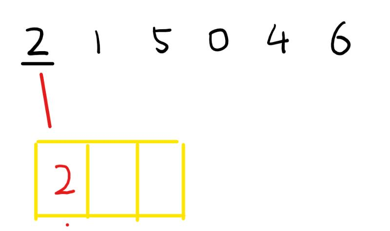
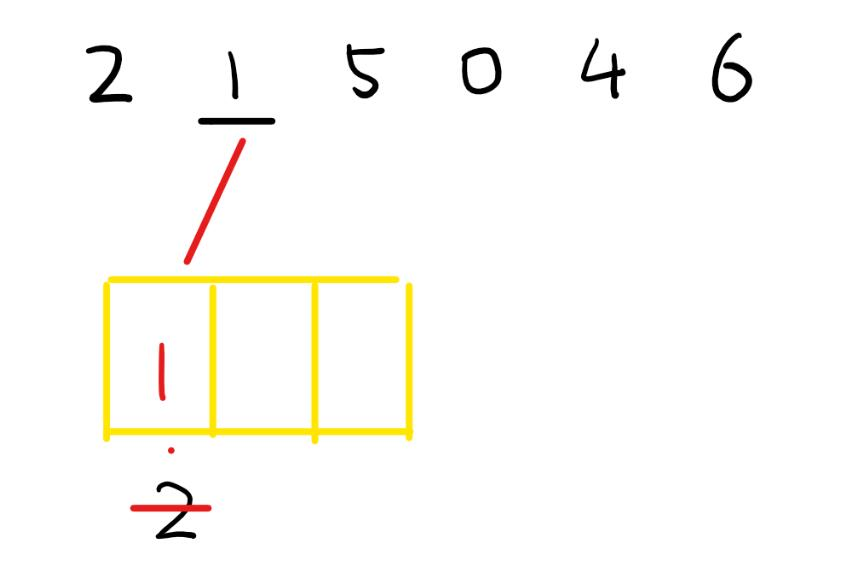
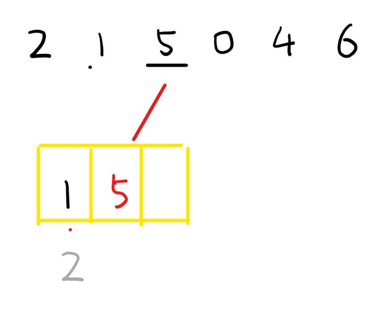
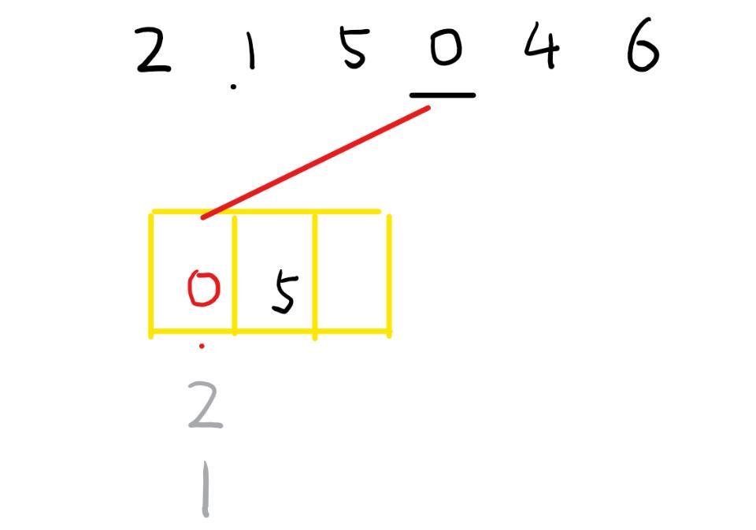
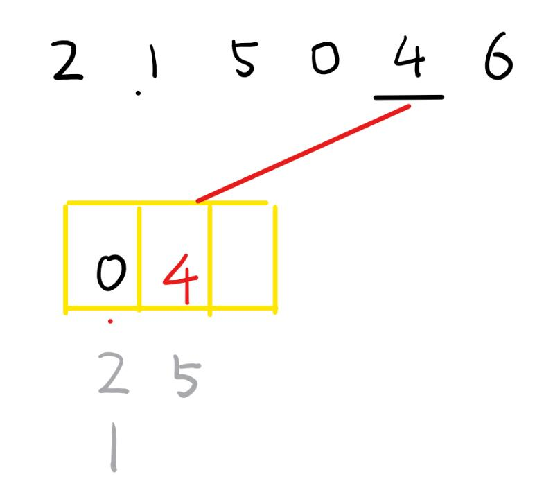

# [Medium][334. Increasing Triplet Subsequence](https://leetcode.com/problems/increasing-triplet-subsequence/)

Given an unsorted array return whether an increasing subsequence of length 3 exists or not in the array.

Formally the function should:

Return true if there exists i, j, k
such that arr[i] < arr[j] < arr[k] given 0 ≤ i < j < k ≤ n-1 else return false.
Note: Your algorithm should run in O(n) time complexity and O(1) space complexity.

**Example 1:**

> Input: [1,2,3,4,5]
> Output: true

**Example 2:**

> Input: [5,4,3,2,1]
> Output: false

## 思路 - brute force

套3个循环，如果当 `nums[x] < nums[y]`进入下一层循环， `nums[y] < nums[z]`则返回true. 循环结束之后都没有返回true,说明没有符合条件的情况，返回false. 时间复杂度最坏的情况下时O(n^3).

## 代码 - brute force

```csharp
public class Solution
{
    public bool IncreasingTriplet(int[] nums)
    {
        if (nums.Length < 2) return false;

        for (int x = 0; x < nums.Length - 2; x++)
        {
            for (int y = x + 1; y < nums.Length - 1; y++)
            {
                if (nums[x] < nums[y])
                {
                    for (int z = y + 1; z < nums.Length; z++)
                    {
                        if (nums[y] < nums[z])
                        {
                            return true;
                        }
                    }
                }
            }
        }
        return false;
    }
}
```

## 思路 - 辅助数组

这里借助一个数组 `int[] store = new int[3] { int.MaxValue, int.MaxValue, int.MaxValue };`来暂存选择出来的符合要求的数字, 即`store[0] < store[1] < store[2]`. 当找到3个数来填充的时候，就成功了。

1. 用nums[0]填充第一个store[0]. 然后向后遍历nums。
2. 如果nums[i] > store[tail]. nums[i]保存在store的下一个元素，store[tail+1] = nums[i].
3. 如果nums[i] < store[tail]. 这个情况比较复杂。要使得store里面保存的数字最小化，这样才能找到3个递增的数字。所以这种情况下大概率时要更新store的。
   * 如果store只有1个元素。那么肯定要更新store[0]的位置。
   * 如果store有多于一个元素的情况。先要比较store[0]的位置，如果`num[i] < store[0]`，那么更新`store[0]`，然后终止。
   * 如果`num[i] == store[0]`，那么不需要更新。
   * 如果`num[i] < store[1]`，更新store[1].
4. 当上述循环执行到store里面3元素都得到填充的时候，成功完成。

下面是图例解说。示例的输入是[2,1,5,0,4,6].

1. 第一步是将nums[0] 放到store[0]中。
   

2. 走到nums[1], 由于赐额是store里面只有一个元素，且 1 < 2 ，所以更新这个位置
   

3. nums[2] = 5，比store[0]大，符合条件，更新到store[1]上。
   

4. nums[3] = 0. 这个时候它比store[0] 和 store[1]都小。更新到 store[0]. 这么做的原因有几点：
   * 判断数字是否加入到store下一个元素，是由store的最后一位来确定的。更新store[0]，不会影响下一个数字的比较。
   * 更新store[0]不会影响原来最后的判断。虽然`1`已经被'0'替代。但是不影响。后面出现的数字如果大于`store[2] (5)` 那么也必然大于`store[0]`
   * 如果后面出现的数字小于`store[2] (5)` 而且是更新`store[1]`上的，必然也要符合大于`store[0]`
   

5. nums[4] = 4, 先比较`store[0]`,因为比它大，所以比较`store[1]`. 替换到`store[1]`上的数字。
   

6. nums[5] = 6, 比较发现比`store[1]`大，所以更新到`store[2]`上面。由于已经找到了3个值，所以返回true.
   

这里的时间复杂度是O(n), 数组只需要扫描一遍。

通用性：如果题设修改为N个数字的递增数列，那么修改为store size为N即可。

## 代码 - 辅助数组

```csharp
public class Solution
{
    public bool IncreasingTriplet(int[] nums)
    {
        if (nums.Length < 2) return false;

        int[] store = new int[3] {int.MaxValue, int.MaxValue, int.MaxValue};
        store[0] = nums[0];
        int tail = 0;

        for(int i = 1; i < nums.Length; i++)
        {
            if(nums[i] < store[tail]) {
                for(int j = 0; j <= tail; j++)
                {
                    if(nums[i] == store[j]){
                        break;
                    } else if(nums[i] < store[j]) {
                        store[j] = nums[i];
                        break;
                    }
                }
            }
            else if(nums[i] > store[tail]) {
                tail++;
                if(tail >= 2) return true;
                store[tail] = nums[i];
            }
        }

        return false;
    }
}
```
