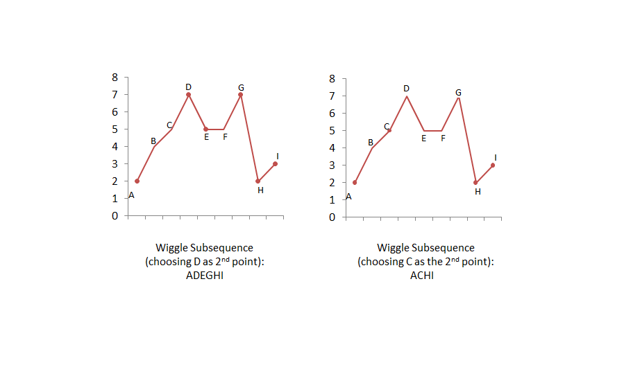

# [Medium][376. Wiggle Subsequence](https://leetcode.com/problems/wiggle-subsequence/)

A sequence of numbers is called a wiggle sequence if the differences between successive numbers strictly alternate between positive and negative. The first difference (if one exists) may be either positive or negative. A sequence with fewer than two elements is trivially a wiggle sequence.

For example, [1,7,4,9,2,5] is a wiggle sequence because the differences (6,-3,5,-7,3) are alternately positive and negative. In contrast, [1,4,7,2,5] and [1,7,4,5,5] are not wiggle sequences, the first because its first two differences are positive and the second because its last difference is zero.

Given a sequence of integers, return the length of the longest subsequence that is a wiggle sequence. A subsequence is obtained by deleting some number of elements (eventually, also zero) from the original sequence, leaving the remaining elements in their original order.

**Example 1:**

Input: [1,7,4,9,2,5]
Output: 6
Explanation: The entire sequence is a wiggle sequence.

**Example 2:**

Input: [1,17,5,10,13,15,10,5,16,8]
Output: 7
Explanation: There are several subsequences that achieve this length. One is [1,17,10,13,10,16,8].

**Example 3:**

Input: [1,2,3,4,5,6,7,8,9]
Output: 2
Follow up:
Can you do it in O(n) time?

## 思路 - 贪心算法

这题目是要求计算最长的摆动序列。观察了上面的提示和示例之后发现几个特点：

1. 当非摆动数字出现的时候，最长摆动序列的计算并不是截断的，而是越过了非摆动数字，继续计算下去。
   例如`[1,17,5,10,13,15,10,5,16,8]`, 这里`[5]`出现的位置导致了摆动序列被截断了。但是最后计算的结果是去除了`[5]`这个数字。这个提示非常重要。按照这个思路，我们可以一边扫描数组，判断上下摆动出现过多少次即可。
2. 要排除相等的情况。摆动序列的要求是上一个是升序，下一个要是降序；上一个是降序，那么下一个是升序。这里隐含了一个条件，就是相等。相等的情况下是要跳过这个数字。
   为了对这个情况进行区分，定义enum类型

   ```csharp
    public enum State{
    Positive,
    Zero,
    Negitive
    }
   ```

例如下图：



时间复杂度：O(N), 对数组进行一次遍历
空间复杂度：O(1)

## 代码 - 贪心算法

```csharp
public class Solution {

    public enum State{
        Positive,
        Zero,
        Negitive
    }

    public int WiggleMaxLength(int[] nums) {
        if( nums.Length < 2) return nums.Length;

        var preState = State.Positive;
        int d = nums[1] - nums[0];

        if(d == 0)
            preState = State.Zero;
        else if(d < 0)
            preState = State.Negitive;

        int ans = preState == State.Zero ? 1 : 2;

        for(int i = 2; i < nums.Length; i++)
        {
            d = nums[i] - nums[i - 1];
            if(d == 0) continue;
            var curState = d > 0 ? State.Positive : State.Negitive;

            if(curState != preState)
            {
                preState = curState;
                ans++;
            }
        }
        return ans;
    }
}
```
