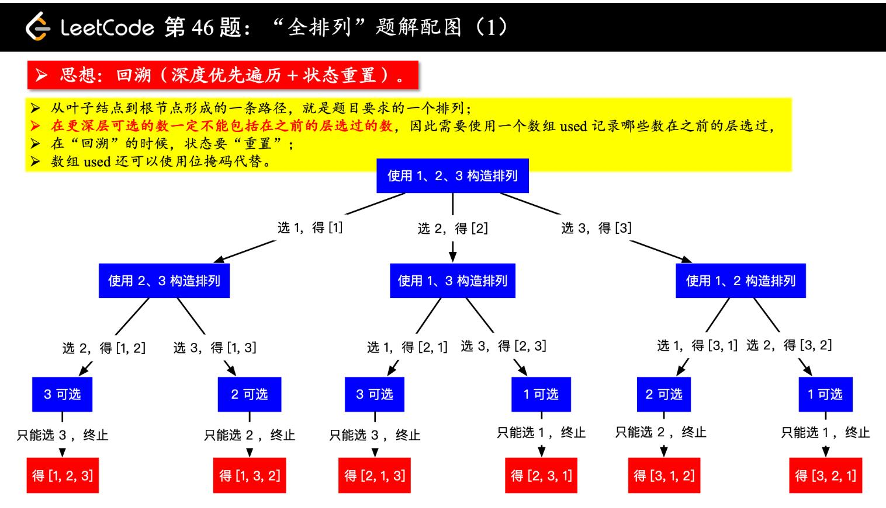

# [Medium][46. Permutations](https://leetcode.com/problems/permutations/)

Given a collection of distinct integers, return all possible permutations.

Example:

```text
Input: [1,2,3]
Output:
[
  [1,2,3],
  [1,3,2],
  [2,1,3],
  [2,3,1],
  [3,1,2],
  [3,2,1]
]
```

## 思路 - 回溯法

固定住一个位置，first, 然后让他的元素跟这个位置交换，完成一遍之后将first向后移动。再重复上面的动作。first是从0开始一直移动到最后一个元素。移动的过程中，左侧的元素已经交换过，所以下一轮交换中，是从first的位置开始,而不需要从i=0的位置开始。
状态重置是回溯的重要操作，“回溯搜索”是有方向的搜索，否则我们要写多重循环，代码量不可控。



[参考](https://leetcode-cn.com/problems/permutations/solution/quan-pai-lie-by-leetcode/)


## 代码 - 回溯法

```csharp
public class Solution {
    public IList<IList<int>> Permute(int[] nums) {

        IList<IList<int>> ans = new List<IList<int>>();
        if(nums == null || nums.Length == 0) return ans;
        PermuteHelper(ans, nums, 0);
        return ans;
    }

    private void PermuteHelper(IList<IList<int>> ans, int[] nums, int first)
    {
        if(nums.Length == first)
        {
            List<int> res = new List<int>();
            res.AddRange(nums);
            ans.Add(res);
        }
        else
        {
            for(int i = first; i < nums.Length; i++)
            {
                Swap(nums, first, i);
                PermuteHelper(ans, nums, first + 1);
                Swap(nums, first, i);
            }
        }
    }

    private void Swap(int[] nums, int x, int y)
    {
        int z = nums[x];
        nums[x] = nums[y];
        nums[y] = z;
    }
}
```
