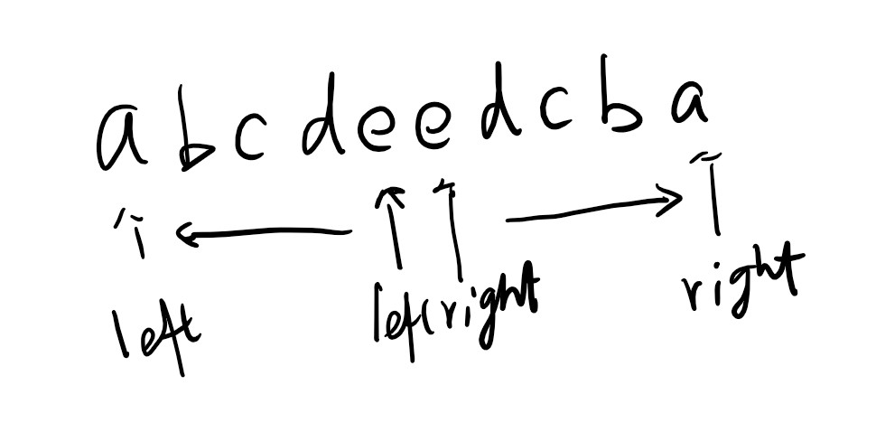
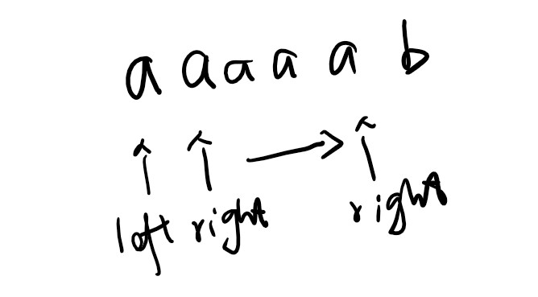
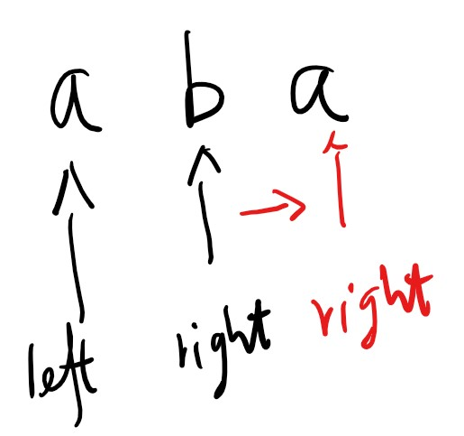

# 5. Longest Palindromic Substring

Given a string s, find the longest palindromic substring in s. You may assume that the maximum length of s is 1000.

**Example 1:**

> Input: "babad"
> Output: "bab"
Note: "aba" is also a valid answer.

**Example 2:**

> Input: "cbbd"
> Output: "bb"

## 思路

此题要求计算最长的回文字长度。回文字的特点就是以中心线为基准两侧的文字一样，比较常见的如：

* aa, aaa, aaaa - 每一字都重复的，中心线展开很宽
* aba - 中心线的字母与两侧不同
* abccba - 中心线的两侧相同

其他的回文字基本可以用上面的Pattern来表示了。
我的思路是假设当前的位置是中心线所在的位置，使用双指针分别表示左侧和右侧的指针。验证左侧和右侧的字母是否相同，如果相同则继续向左右两侧移动，直到队列头/尾或者字符不等。



讨论第一种情况。字母都都一样的情况可以认为是一种回文字。这种情况下可以直接将指针一直移动到不同的位置截至。



在遇第一种情况的时候，可以将i直接向右侧移动，因为这些字母都是回文字的一部分。

```csharp
    while(right < chs.Length && chs[left] == chs[right])
    {
        right ++;
        i++;
        match1 = true;
    }
```

但是这里存在一个问题，当条件满足的时候，会执行一遍 right++; i++, 那么下一次循环不满足的时候， right 和 i 实际上向右多走了一位。所有如果执行过，就需要将 right 和 i 向左移动回来一位。

```csharp
    while(right < chs.Length && chs[left] == chs[right])
    {
        right ++;
        i++;
        match1 = true;
    }
    if(match1)
    {
        right--;
        i--;
    }
```

下一步是要处理中心线字母与两侧不同的情况，即 aba. 这意味着，初始的时候，left 和 right的字母不同也是可以接受的，这个时候要将right向右移动一位再进行比较。



```csharp
    if(right < chs.Length - 1 && chs[right] != chs[left])
    {
        right ++;
    }
```

上面两边是将 left和 right的位置确定好。下一步要开始向两侧移动了。停止的条件是到达数组的两头，或者两边的字母不相等。

```csharp
    while(left >= 0 && right <= chs.Length - 1 && chs[left] == chs[right])
    {
        match2 = true;
        left--;
        right++;
    }
```

这里同样会遇到一个问题，一旦进入循环种，直到循环条件未满足的时候left 和 right都会多走一步。所有需要判断如果循环执行过，那么就需要将left 和 right 往回移动一步。

```csharp
    while(left >= 0 && right <= chs.Length - 1 && chs[left] == chs[right])
    {
        match2 = true;
        left--;
        right++;
    }
    if(match2)
    {
        left++;
        right--;
    }
```

## 代码

```csharp
public class Solution {
    public string LongestPalindrome(string s) {

        if(s == null || s.Length <= 1) return s;

        char[] chs = s.ToCharArray();

        int l = 0;
        int r = 0;
        int m = 0;

        for(int i = 1; i < chs.Length; i++)
        {
            int left = i - 1;
            int right = i;
            bool match2 = false;
            bool match1 = false;

            while(right < chs.Length && chs[left] == chs[right])
            {
                right ++;
                i++;
                match1 = true;
            }
            if(match1)
            {
                right--;
                i--;
            }

            if(right < chs.Length - 1 && chs[right] != chs[left])
            {
                right++;
            }

            while(left >= 0 && right <= chs.Length - 1 && chs[left] == chs[right])
            {
                match2 = true;
                left--;
                right++;
            }
            if(match2)
            {
                left++;
                right--;
            }

            if((match1 || match2) && m < right - left)
            {
                m = right - left;
                l = left;
                r = right;
            }

        }

        return s.Substring(l, r - l + 1);

    }
}
```
