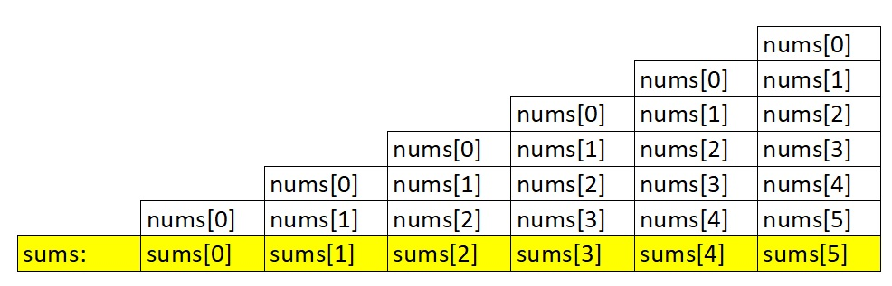
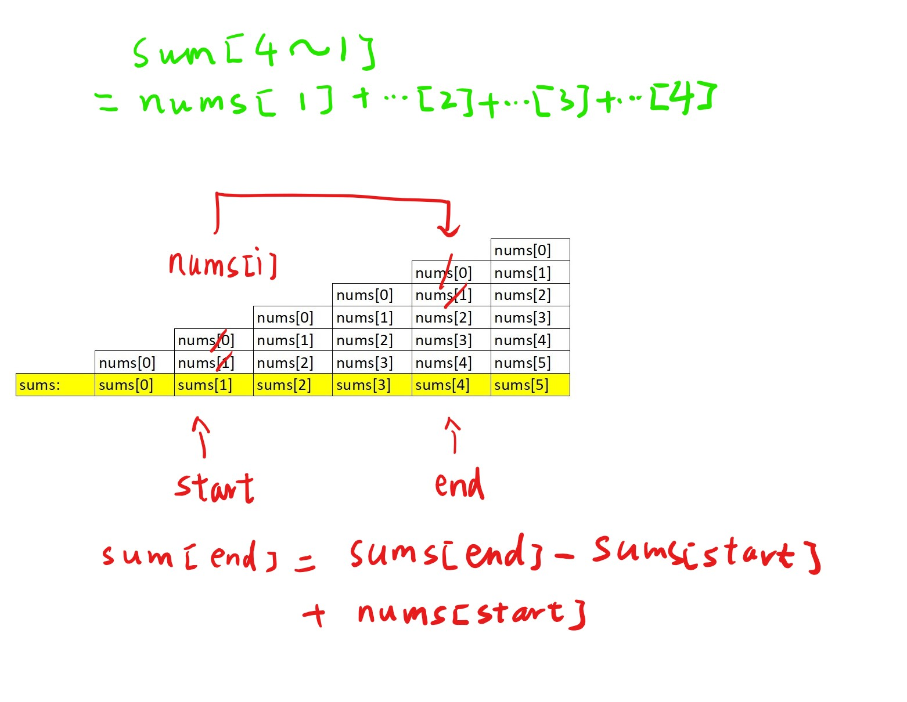

# [Medium][523. Continuous Subarray Sum](https://leetcode.com/problems/continuous-subarray-sum/)

Given a list of non-negative numbers and a target integer k, write a function to check if the array has a continuous subarray of size at least 2 that sums up to a multiple of k, that is, sums up to n*k where n is also an integer.

**Example 1:**

> Input: [23, 2, 4, 6, 7],  k=6
> Output: True
> Explanation: Because [2, 4] is a continuous subarray of size 2 and sums up to 6.

**Example 2:**

> Input: [23, 2, 6, 4, 7],  k=6
> Output: True
> Explanation: Because [23, 2, 6, 4, 7] is an continuous subarray of size 5 and sums up to 42.

Note:

> The length of the array won't exceed 10,000.
> You may assume the sum of all the numbers is in the range of a signed 32-bit integer.

## 思路 - 暴力破解

这道题要求计算出一段连续的空间里面是否存在着一串数字之和等于K或者是K的倍数。提示为这个array不会太长，在10000以内。所有数之和不会超过32-bit的最大值，所以不需要考虑溢出的问题。

对于K，题目要求是sums = K 或者是sums = n * K. 所以可以在 `sum % K == 0`的情况下返回true. 但是有个特别的地方就是0. 如果`K == 0`, 调用`sum % K == 0`会产生除0错。所以要额外的判断K==0的情况下，只能是sum = K.即 `if(sum == k || (k != 0 && sum % k == 0)) return true;`

如何求出连续空间内的sum. 由于要求是连续的元素之和，使用双指针划定一个滑动窗口，左边的指针是窗口开始位置，右侧是窗口的结束位置。在窗口内滑动计算sums.

```csharp
for (int start = 0; start < nums.Length - 1; start++)   // 左边界
{
    for (int end = start + 1; end < nums.Length; end++) // 右边界
    {
        int sum = 0;
        for (int i = start; i <= end; i++)  // 计算sums
            sum += nums[i];
        if (sum == k || (k != 0 && sum % k == 0))   // 判断是否符合要求
            return true;
    }
}
```

时间复杂度 O(N^3), `左边界 * 右边界 * 内循环`
空间复杂度 O(1), 没有借助辅助变量

## 代码  - 暴力破解

```csharp
public bool CheckSubarraySum(int[] nums, int k)
{

    for (int start = 0; start < nums.Length - 1; start++)
    {
        for (int end = start + 1; end < nums.Length; end++)
        {
            int sum = 0;
            for (int i = start; i <= end; i++)
                sum += nums[i];
            if (sum == k || (k != 0 && sum % k == 0))
                return true;
        }
    }
    return false;
}
```

## 思路 - 暴力算法 - 优化

上面的思路是O(N^3) ，内循环可以进行优化。内循环的作用是在滑动窗口内计算sum。可以用一个int[] sums来保存sum的结果。这样可以省略掉最里面的内循环。
可以先用一次循环计算`nums[0]` 到`nums[i]`的和。

```csharp
for(int i = 1; i < nums.Length; i++)
    sums[i] = sums[i - 1] + nums[i];
```

计算的结果如下图所示 :


那么如何计算内循环的sum呢。start 到 end之间的`sum = sums[end] - sums[start] + nums[start]`.



这里以start = 1, end = 4 为例。 如果第一种方式，sum 1 ~ 4 的值应该是 `sum = nums[1] + nums[2] + nums[3] + nums[4]`. 观察图形， sums[4]上面已经加盖了nums[0] ~ nums[4], 因为求和是从nums[0]开始的。同样，sums[1]上面的是nums[0] ~ nums[1]，所以sums[4] - sums[1] 能把上面的去掉，这样还缺一个nums[1]. 把nums[1]重新加上去就完成了。

时间复杂度 ： O(N^2)
空间复杂度 ： O(N)

## 代码 - 暴力算法 - 优化

```csharp
public class Solution {
    public bool CheckSubarraySum(int[] nums, int k) {
        int[] sums = new int[nums.Length];
        sums[0] = nums[0];
        for(int i = 1; i < nums.Length; i++)
            sums[i] = sums[i - 1] + nums[i];

        for(int start = 0; start <= nums.Length - 2; start++)
        {
            for(int end = start + 1; end <= nums.Length - 1; end++)
            {
                int sum = sums[end] - sums[start] + nums[start];
                if(sum == k || (k != 0 && sum % k == 0)) return true;
            }
        }
        return false;
    }
}
```

## [思路 - Dictionary](https://leetcode-cn.com/problems/continuous-subarray-sum/solution/lian-xu-de-zi-shu-zu-qiu-he-by-lenn123/)

这里利用的是反证法。假设某段范围之间的sums(i, j)能够符合要求. 必然要求(i, j)之间的和能够被k整除。加入sums[i]是nums[0 ~ i]的和， sums[j]是nums[0 ~ j]之和，那么 i ~ j之间的和是sums[j] - sums[i]. 他们会有下面的规律 ：

* 我们要判断 (sums[j] - sums[i]) % k是否为0，
* 按照mod的运算性质，`(sums[j] - sums[i]) % k == sums[j] % k - sums[i] % k`
* 若`(sums[j] - sums[i]) % k == 0`, 则，sums[j] % k == sums[i] % k。

所以我们要计算是否之前已经出现过同样的 sums[i] % k 的结果即可。为了降低第二层循环的时间，可以使用Dictionary,来保存sums[i] % k 的结果，因为使用Dictionary的时间复杂度为O(1). 相当于用O(N)的空间复杂度置换了O(N)的空间复杂度。

下面是nums: [2, 5, 33, 6, 7, 25, 15] k=13的求解过程。


仅仅保存曾经出现过的 sums[i] % k的结果就足够了吗? 如果是只要的话，使用`List<int>`就可以。但是为什么要用Dictionary？ 原因是 `k 可能为 0`. 上面2种方法都要应当k==0的情况。这里也不例外。为了应对0的情况，保存sums[i] % k的结果的同时，还要保存i的位置。如果为0的情况下，逻辑就转变为，0的值是否出现过。初始值的时候将map种设置`map.Add(0, -1);`。将0的位置i设定为-1， 未出现过。第一次遇到0的时候将它设置为i，表示已经出现过。再次遇到0的时候，就可以返回true.

时间复杂度 ： O(N)
空间复杂度 ： O(N)

## 代码 - Dictionary

```csharp
public bool CheckSubarraySum(int[] nums, int k)
{
    int sum = 0;
    Dictionary<int, int> map = new Dictionary<int, int>();
    map.Add(0, -1);
    for (int i = 0; i < nums.Length; i++)
    {
        sum += nums[i];
        if (k != 0)
            sum = sum % k;
        if (map.ContainsKey(sum))
        {
            if (i - map[sum] > 1)
                return true;
        }
        else
            map.Add(sum, i);
    }
    return false;
}
```
