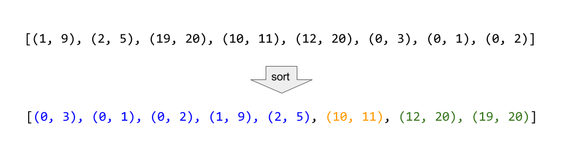

# 56. Merge Intervals

Given a collection of intervals, merge all overlapping intervals.

**Example 1:**

> Input: [[1,3],[2,6],[8,10],[15,18]]
> Output: [[1,6],[8,10],[15,18]]
> Explanation: Since intervals [1,3] and [2,6] overlaps, merge them into [1,6].

**Example 2:**

> Input: [[1,4],[4,5]]
> Output: [[1,5]]
> Explanation: Intervals [1,4] and [4,5] are considered overlapping.

NOTE: input types have been changed on April 15, 2019. Please reset to default code definition to get new method signature.

## 思路 - 排序

这道题目要求合并数字区域。如果两个int[]范围有相交或者覆盖的话，就要合并区域。否则不变。

常见的情况可能包括下面几种 ：

> ints[i].end<ints[j].start
> ints[j].end<ints[k].start
> ints[i].end≥ints[k].start

为了把问题简单化，我们可以先按照ints[i].start进行排序，保证左侧的数字有序。然后再对右侧的范围进行分析。这样每次只需要看一边就好了。



这里借助了一个`List<int[]>`进行排序. `int[][] intervals` 有一次外循环， `List<int[]>` 一次内循环。由于 `List<int[]>` 最后的长度是相等的，之后又进行一次合并， 所以时间复杂度是O(N^2) + O(N) = O(N^2).

## 代码 - 排序

```csharp
public class Solution {
    public int[][] Merge(int[][] intervals)
    {

        if (intervals.Length <= 1) return intervals;
        List<int[]> ans = new List<int[]>();

        ans.Add(intervals[0]);
        for (int i = 1; i < intervals.Length; i++)
        {
            bool added = false;
            for (int j = 0; j < ans.Count; j++)
            {
                if(ans[j][0] > intervals[i][0])
                {
                    ans.Insert(j, intervals[i]);
                    added = true;
                    break;
                }
            }
            if (!added) ans.Add(intervals[i]);
        }

        for (int i = 0; i < ans.Count - 1; i++)
        {
            if(ans[i][1] >= ans[i + 1][0])
            {
                ans[i][1] = Math.Max(ans[i][1], ans[i + 1][1]);
                ans.RemoveAt(i + 1);
                i -= 1;
            }
        }

        return ans.ToArray();
    }
}
```

## 思路 - 快速排序

上面可以看出比较耗时间的是排序部分。为了优化算法，可以采用快速排序，不需要借助`List<int>`, 在原地可以完成交换，提高效率。不会后面合并的时候还是需要借助`List<int>`.

时间复杂度O(NLgN) + O(N) + O(N) = O(NlgN).

## 代码 - 快速排序

```csharp
public class Solution
{
    public int[][] Merge(int[][] intervals)
    {

        if (intervals.Length <= 1) return intervals;

        QuickSort(intervals, 0, intervals.Length - 1);

        List<int[]> ans = new List<int[]>();

        for (int i = 0; i < intervals.Length; i++)
        {
            ans.Add(intervals[i]);
        }

        for (int i = 0; i < ans.Count - 1; i++)
        {
            if(ans[i][1] >= ans[i + 1][0])
            {
                ans[i][1] = Math.Max(ans[i][1], ans[i + 1][1]);
                ans.RemoveAt(i + 1);
                i -= 1;
            }
        }

        return ans.ToArray();
    }

    private void QuickSort(int[][] nums, int lo, int hi)
    {
        if (lo < hi)
        {
            int part = Partition(nums, lo, hi);
            QuickSort(nums, lo, part - 1);
            QuickSort(nums, part + 1, hi);
        }
    }

    private int Partition(int[][] nums, int lo, int hi)
    {
        int i = lo;
        int j = hi + 1;
        while(true)
        {
            while (nums[++i][0] < nums[lo][0]) if (i == hi) break;
            while (nums[--j][0] > nums[lo][0]) if (j == lo) break;
            if (i >= j) break;
            Swap(nums, i, j);
        }
        Swap(nums, lo, j);
        return j;
    }

    private void Swap(int[][] nums, int x, int y)
    {
        int[] tmp = nums[x];
        nums[x] = nums[y];
        nums[y] = tmp;
    }
}
```

## 思路 - Sort

还是同样的思路，不过用Array.Sort的的话，能减少很多代码。

## 代码 - Sort

```csharp
    public class Solution
    {
        public int[][] Merge(int[][] intervals)
        {
            List<int[]> res = new List<int[]>();

            if (intervals.Length == 0) return res.ToArray();

            Array.Sort(intervals, (a, b) =>
            {
                if (a[0].CompareTo(b[0]) == 0) return a[1].CompareTo(b[1]);
                return a[0].CompareTo(b[0]);
            });

            res.Add(intervals[0]);
            for (int i = 1; i < intervals.Length; i++)
            {
                var resLast = res[res.Count - 1];
                if (intervals[i][0] <= resLast[1])
                {
                    resLast[1] = Math.Max(intervals[i][1], resLast[1]);
                }
                else
                {
                    res.Add(intervals[i]);
                }
            }

            return res.ToArray();
        }
    }
```
