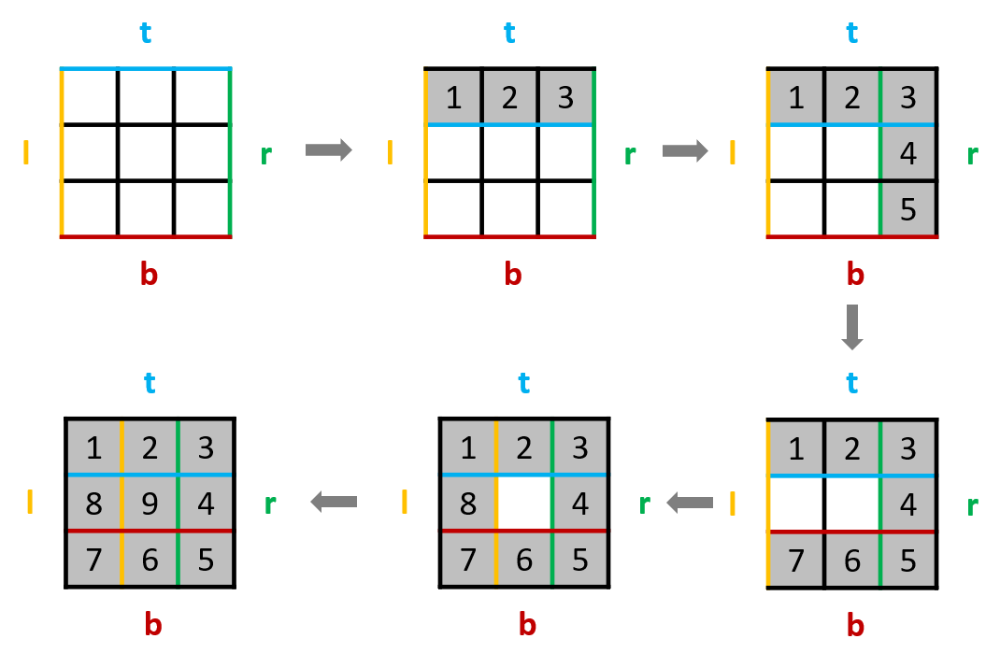

# 59. Spiral Matrix II

Given a positive integer n, generate a square matrix filled with elements from 1 to n2 in spiral order.

**Example:**

```text
Input: 3
Output:
[
 [ 1, 2, 3 ],
 [ 8, 9, 4 ],
 [ 7, 6, 5 ]
]
```

## 思路

跟 [# 885. Spiral Matrix III](../885.%20Spiral%20Matrix%20III) 的思路很类似。重点是在于边界值的设定。这里设定了2条边界，vertical 和 horizon。每次碰到边界的时候对应方向的边界值 -1 即可。


## 代码

```csharp
public class Solution
{
    public int[][] GenerateMatrix(int n)
    {
        int count = (int)(n * n);
        int[][] ans = new int[n][];

        for (int i = 0; i < ans.Length; i++)
        {
            ans[i] = new int[n];
        }

        int[] bd = new int[2] { n, n - 1};          // define 2 boundaries, vertical and horizon
        int[] dc = new int[4] { 1, 0, -1, 0 };      // define colume index operations in 4 direction
        int[] dr = new int[4] { 0, 1, 0, -1 };      // define row index operations in 4 direction
        int d = 0;  // direction : 0 - E; 1 - S; 2 - W; 3 - N;
        int c = -1;  // columne index
        int r = 0;  // row index
        int steps = 0;

        for (int i = 1; i <= count;)
        {
            steps = bd[d % 2];

            for (int move = 0; move < steps; move++)
            {
                c += dc[d];
                r += dr[d];
                ans[r][c] = i;
                i += 1;
            }

            bd[d % 2] -= 1;
            d = (d + 1) % 4;
        }

        return ans;
    }
}
```
