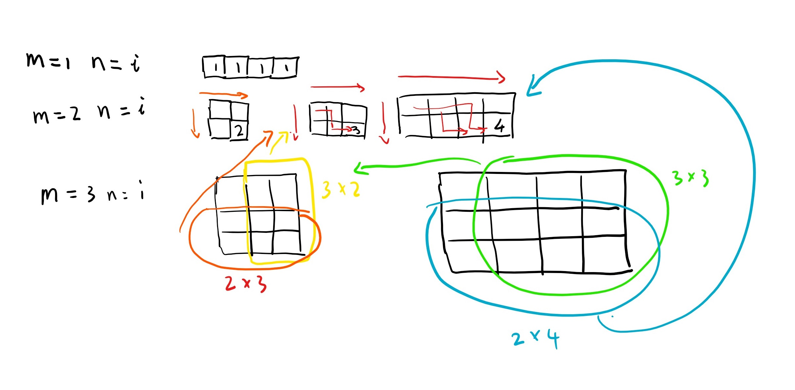
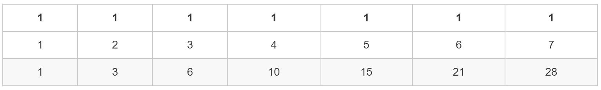
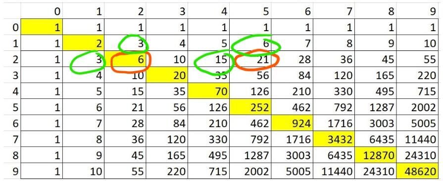

# [62. Unique Paths](https://leetcode.com/problems/unique-paths/)

A robot is located at the top-left corner of a m x n grid (marked 'Start' in the diagram below).


The robot can only move either down or right at any point in time. The robot is trying to reach the bottom-right corner of the grid (marked 'Finish' in the diagram below).

How many possible unique paths are there?

Above is a 7 x 3 grid. How many possible unique paths are there?

Note: m and n will be at most 100.

**Example 1:**

```text
Input: m = 3, n = 2
Output: 3
Explanation:
From the top-left corner, there are a total of 3 ways to reach the bottom-right corner:

1. Right -> Right -> Down
2. Right -> Down -> Right
3. Down -> Right -> Right
```

**Example 2:**

> Input: m = 7, n = 3
> Output: 28

## 思路 - 动态规划

观察机器人路线的可能性。

1. **m == 1 || n == 1**. 当 只有一行或者一列的适合，都只有一条路径。
2. **m == 2 || n == 2**. 讨论有2行的情况，两列的情况其实时一样的，就是偏转90°就会获得一样的图形。这种情况下，通过的路径由他的列数来决定。例如 2 X 2 有 2种可能性， 2 X n 有n种可能性。
3. **m == 3 || n == 3**. 这个时候图形更加明显了，m X n的图形可以由原点，m X (n - 1) 和 (m - 1) X n组成。例如 3 X 3 由 2个 2 X 2和远点组成，他的路径数量时 两个 2 X 2的图的路径数量之和。 同理3 X 4 的图，由一个 3 X 3 和一个 2 X 4组成。这样就总结出来一个规律。



* m == 1 || n == 1 ： count =  1
* m >= 2 && n >= 2 : count = count(m - 1, n) + count(m, n - 1)

到这一步基本上可以确定使用dp来实现了。

时间复杂度O(2 ^ N). 好吧, 超时了。

## 代码 - 动态规划

```csharp
public class Solution {
    public int UniquePaths(int m, int n) {
        if(m <= 1 || n <= 1) return Math.Min(m, n);
        return UniquePaths(m - 1, n) + UniquePaths(m, n - 1);
    }
}
```

## 思路 - 动态规划 - 二维矩阵

将最终的结果与`[m,n]`的关系画张表格，结果如下。计算出这个`int[,]`最后一位的值即可。

时间复杂度 `O(m * n)`,空间复杂度 `O(m * n)`.



## 代码 - 动态规划 - 二维矩阵

```csharp
public class Solution {

    public int UniquePaths(int m, int n) {
        if(m <= 1 || n <= 1) return Math.Min(m, n);

        int[,] matrix = new int[m,n];

        for(int i = 0; i < m; i++)
            matrix[i, 0] = 1;

        for(int i = 0; i < n; i++)
            matrix[0, i] = 1;

        for(int i = 1; i < m; i++)
            for(int j = 1; j < n; j++)
                matrix[i, j] = matrix[i - 1, j] + matrix[i, j - 1];

        return matrix[m - 1, n - 1];
    }
}
```

## 思路 - 动态规划 - 辅助数组[压缩空间]

使用二维矩阵的时候，使用到的的空间复杂度时O(m * n). 考虑一下是可以进行压缩的。观察一下结果集。可以直到`[m, n]`的结果可以由`[m - 1, n] + [m, n  - 1]` 计算出来的。比如`matrix[2,2] = matrix[2, 1] + matrix[1, 2]`, 以及`matrix[2,5] = matrix[2, 4] + matrix[1, 5]`.



那么实际上可以用2个`int[]`来分别代表当前这一行的结果集，和上一行的结果集。例如下图， 需要一个preCol数组保持上一轮计算的结果,curCol从左边依次计算到`[m, n]`的位置。


时间复杂度 O (m * n), 空间复杂度 O (m + n)

## 代码 - 动态规划 - 辅助数组[压缩空间]

```csharp
public int UniquePaths(int m, int n)
{
    if (m <= 1 || n <= 1)
        return Math.Min(m, n);

    int[] curCol = new int[n];
    int[] preCol = new int[n];

    for(int i = 0; i < m; i ++)
    {
        for(int j = 0; j < n; j++)
        {
            if(i == 0 && j == 0)    // firt row, set 1
            {
                curCol[j] = 1;
            }
            else if(i == 0)     // first columne
            {
                curCol[j] = curCol[j - 1];
            }
            else if(j == 0)
            {
                curCol[j] = preCol[j];
            }
            else
            {
                curCol[j] = curCol[j - 1] + preCol[j];
            }
        }
        preCol = curCol;
    }

    return curCol[n - 1];
}
```

## 思路 - 动态规划 - 一维数组[压缩空间]

上面的方法，还能继续压缩空间。二维数组可以替换为一维数组。观察上面的代码，当执行过`curCol[j] = curCol[j - 1] + preCol[j];`后，`preCol[j]`的value就不再需要使用了，下一个curCol的元素由下个preCol的元素来辅助计算。即，`curCol[j + 1] = curCol[j] + preCol[j + 1];`，这里已经没有preCol[j]什么事情。所有其实preCol[j]使用完之后就可以本覆盖掉，而不会影响计算的结果。考虑到这一点，可以将2个数组用一个数组来代替。为了方便思考和阅读，还是用`curCol`和`preCol`，但实际上是指向一个数组。

## 代码 - 动态规划 - 一维数组[压缩空间]

```csharp
public class Solution {

    public int UniquePaths(int m, int n)
    {
        if (m <= 1 || n <= 1)
            return Math.Min(m, n);

        int[] curCol = new int[n];
        int[] preCol = curCol;

        for (int i = 0; i < m; i ++)
        {
            for(int j = 0; j < n; j++)
            {
                if(i == 0 && j == 0)    // firt row, set 1
                {
                    curCol[j] = 1;
                }
                else if(i == 0)     // first columne
                {
                    curCol[j] = curCol[j - 1];
                }
                else if(j == 0)
                {
                    curCol[j] = preCol[j];
                }
                else
                {
                    curCol[j] = curCol[j - 1] + preCol[j];
                }
            }
            preCol = curCol;
        }

        return curCol[n - 1];
    }

}
```
