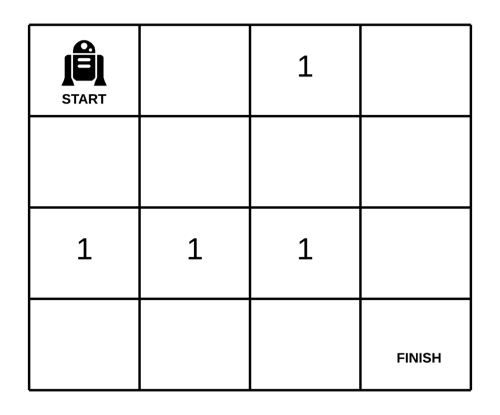

# [Medium][63. Unique Paths II](https://leetcode.com/problems/unique-paths-ii/)

A robot is located at the top-left corner of a m x n grid (marked 'Start' in the diagram below).

The robot can only move either down or right at any point in time. The robot is trying to reach the bottom-right corner of the grid (marked 'Finish' in the diagram below).

Now consider if some obstacles are added to the grids. How many unique paths would there be?


An obstacle and empty space is marked as 1 and 0 respectively in the grid.

Note: m and n will be at most 100.

**Example 1:**

```text
Input:
[
  [0,0,0],
  [0,1,0],
  [0,0,0]
]
```

Output: 2

Explanation:
There is one obstacle in the middle of the 3x3 grid above.
There are two ways to reach the bottom-right corner:

1. Right -> Right -> Down -> Down
2. Down -> Down -> Right -> Right

## 思路 - DP

这里跟[62. Unique Paths](src/62.%20Unique%20Paths). 区别在于增加了路障。总体的思路还是跟62一样，利用辅助的二维矩阵来计算到达的路径。由于输入值本身就是一个二维矩阵，所以在原地进行计算即可。

首先将obstacleGrid第一行和第一列置为1，表示沿着边上到达的目的地的路径数是1. 由于路障的存在，要对逻辑进行少许修改。

1. 当`obstacleGrid[0][0]`里面是1的时候代表起始点就是路障，后面完全堵死，直接返回0.
2. 将·设置初始值。如果`obstacleGrid[0][i] == 0`表示没有路障，设定为1，如果`obstacleGrid[0][i] == 1`，从当前位置开始设定为0，因为路已经被堵上。
3. 将`obstacleGrid[i][0]`设置初始值。这里要注意的是起始点为 obstacleGrid[1][0].逻辑同上。
4. 从·开始，逻辑基本同62. `obstacleGrid[i][j] = obstacleGrid[i - 1][j] + obstacleGrid[i][j - 1]`。不过有个例外`obstacleGrid[i][j] == 1`的时候，将其内容设定为0.
5. 计算完成之后返回`obstacleGrid[n][n]`的值。




## 代码 - DP

```csharp
public class Solution {
    public int UniquePathsWithObstacles(int[][] obstacleGrid)
    {

        if (obstacleGrid == null || obstacleGrid.Length == 0 || obstacleGrid[0].Length == 0 || obstacleGrid[0][0] == 1) return 0;
        int Row = obstacleGrid.Length;
        int Col = obstacleGrid[0].Length;

        for (int i = 0; i < Col; i++)
        {
            if (obstacleGrid[0][i] == 1)
            {
                for (; i < Col; i++)
                    obstacleGrid[0][i] = 0;
            }
            else
            {
                obstacleGrid[0][i] = 1;
            }
        }
        for (int i = 1; i < Row; i++)
        {
            if (obstacleGrid[i][0] == 1)
            {
                for (; i < Row; i++)
                    obstacleGrid[i][0] = 0;
            }
            else
            {
                obstacleGrid[i][0] = 1;
            }
        }

        for (int i = 1; i < Row; i++)
        {
            for (int j = 1; j < Col; j++)
            {
                obstacleGrid[i][j] = obstacleGrid[i][j] == 1 ? 0 : (obstacleGrid[i - 1][j] + obstacleGrid[i][j - 1]);
            }
        }
        return obstacleGrid[Row - 1][Col - 1];
    }
}
```
