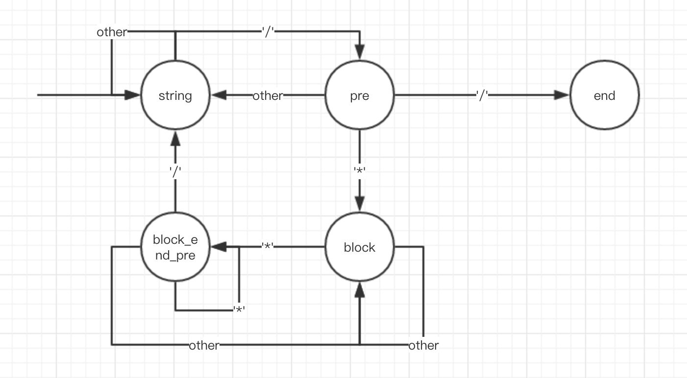

# [Medium][722. Remove Comments](https://leetcode.com/problems/remove-comments/)

Given a C++ program, remove comments from it. The program source is an array where source[i] is the i-th line of the source code. This represents the result of splitting the original source code string by the newline character \n.

In C++, there are two types of comments, line comments, and block comments.

The string // denotes a line comment, which represents that it and rest of the characters to the right of it in the same line should be ignored.

The string /* denotes a block comment, which represents that all characters until the next (non-overlapping) occurrence of */ should be ignored. (Here, occurrences happen in reading order: line by line from left to right.) To be clear, the string /*/ does not yet end the block comment, as the ending would be overlapping the beginning.

The first effective comment takes precedence over others: if the string // occurs in a block comment, it is ignored. Similarly, if the string /* occurs in a line or block comment, it is also ignored.

If a certain line of code is empty after removing comments, you must not output that line: each string in the answer list will be non-empty.

There will be no control characters, single quote, or double quote characters. For example, source = "string s = "/* Not a comment. */";" will not be a test case. (Also, nothing else such as defines or macros will interfere with the comments.)

It is guaranteed that every open block comment will eventually be closed, so /* outside of a line or block comment always starts a new comment.

Finally, implicit newline characters can be deleted by block comments. Please see the examples below for details.

After removing the comments from the source code, return the source code in the same format.

**Example 1:**

```text
Input:
source = ["/*Test program */", "int main()", "{ ", "  // variable declaration ", "int a, b, c;", "/* This is a test", "   multiline  ", "   comment for ", "   testing */", "a = b + c;", "}"]

The line by line code is visualized as below:
/*Test program */
int main()
{
  // variable declaration
int a, b, c;
/* This is a test
   multiline  
   comment for
   testing */
a = b + c;
}
```

**Output:** `["int main()","{ ","  ","int a, b, c;","a = b + c;","}"]`

```text
The line by line code is visualized as below:
int main()
{
  
int a, b, c;
a = b + c;
}
```

**Explanation:**

> The string /* denotes a block comment, including line 1 and lines 6-9. The string // denotes line 4 as comments.

Example 2:

```text
Input:
source = ["a/*comment", "line", "more_comment*/b"]
Output: ["ab"]
Explanation: The original source string is "a/*comment\nline\nmore_comment*/b", where we have bolded the newline characters.  After deletion, the implicit newline characters are deleted, leaving the string "ab", which when delimited by newline characters becomes ["ab"].
```

**Note:**

* The length of source is in the range [1, 100].
* The length of source[i] is in the range [0, 80].
* Every open block comment is eventually closed.
* There are no single-quote, double-quote, or control characters in the source code.

## 思路 - 状态机

这题的要求就是消除注释。注释的方式有2种

* `//` 行注释， 去除后面的所有内容
* `/* */` 块注释， 去除块内的注释

这里面 `//`比较容易处理，如果先出现行注释，则后面的都内容都去掉。

`/* */` 块注释就比较复杂 ：

1. 先出现块注释的开头 `/*`, 那么要搜索下一个 '*/', 之间如果出现了 行注释，要忽略
2. '*/' 在同行的情况，要先删除块内的内容，整行还需要重新执行一次逻辑，以去除 其他'//' 或者 `/* */`的情况。
3. '*/' 在不同行的情况，要一直略过多行，直到找到一个 '*/'。

画出状态机后，整个情况就会显得比较清晰：



## 代码 - 状态机

```csharp
public class Solution {
    public IList<string> RemoveComments(string[] source)
    {
        IList<string> ans = new List<string>();
        bool isBlock = false;
        string strBlock = string.Empty;

        for (int i = 0; i < source.Length; i++)
        {
            string str = source[i];
            int index = str.IndexOf("/");

            for (; index <= str.Length - 1 && index >= 0; index++)
            {
                if (isBlock && str.Contains("*/")) // '*/'
                {
                    index = str.IndexOf("*/");
                    str = strBlock + str.Remove(0, index + 2);
                    isBlock = false;
                    index = str.IndexOf("/") - 1;
                }
                else if (!isBlock && index < str.Length - 1 && str[index] == '/' && str[index + 1] == '/') // 'xxxx//'
                {
                    str = str.Remove(index);
                    index = str.Length - 1;
                }
                else if (!isBlock && index < str.Length - 1 && str[index] == '/' && str[index + 1] == '*')   // '/*'
                {
                    int endIndex = -1;
                    if (index < str.Length - 2) endIndex = str.IndexOf("*/", index + 2);
                    if (endIndex == -1)  // doesn't have '*/' in the same line
                    {
                        str = str.Remove(index);
                        index = str.Length - 1;
                        if (!string.IsNullOrEmpty(str)) strBlock = str;
                        isBlock = true;
                    }
                    else
                    {
                        str = str.Remove(index, endIndex + 2 - index);
                        index = str.IndexOf("/") - 1;
                    }
                }
            }
            if (!isBlock)
                if (!string.IsNullOrEmpty(str)) ans.Add(str);
        }

        return ans;
    }
}
```
