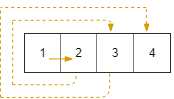

# [Medium][885. Spiral Matrix III](https://leetcode.com/problems/spiral-matrix-iii/)

On a 2 dimensional grid with R rows and C columns, we start at (r0, c0) facing east.

Here, the north-west corner of the grid is at the first row and column, and the south-east corner of the grid is at the last row and column.

Now, we walk in a clockwise spiral shape to visit every position in this grid.

Whenever we would move outside the boundary of the grid, we continue our walk outside the grid (but may return to the grid boundary later.)

Eventually, we reach all R * C spaces of the grid.

Return a list of coordinates representing the positions of the grid in the order they were visited.

**Example 1:**

> Input: R = 1, C = 4, r0 = 0, c0 = 0
> Output: [[0,0],[0,1],[0,2],[0,3]]



**Example 2:**

> Input: R = 5, C = 6, r0 = 1, c0 = 4
> Output: [[1,4],[1,5],[2,5],[2,4],[2,3],[1,3],[0,3],[0,4],[0,5],[3,5],[3,4],[3,3],[3,2],[2,2],[1,2],[0,2],[4,5],[4,4],[4,3],[4,2],[4,1],[3,1],[2,1],[1,1],[0,1],[4,0],[3,0],[2,0],[1,0],[0,0]]


Note:

> 1 <= R <= 100
> 1 <= C <= 100
> 0 <= r0 < R
> 0 <= c0 < C

## 思路

这道题的思路是给出一个 R * C的二维矩阵，一个起始点[r0,c0]. 先面向东（E), 然后向南（S)，再西（W），最后北（N），做顺时针的运动。最后会遍历整个二维矩阵，要求给出经过路径的坐标。

这里有几个点，一个是方向。我用数字0-4分别表示4个方向 0 : E, 1 : S, 2 : W, 3 : N.

另外一个是前进的步数。注意观察发现，开始朝一个方向的前进的步数是1. 当发生转向的时候，如果转过去方向是E或者W，即`direction % 2 == 0`的时候，步数要加1.

转向。当一个方向的步数走完的时候，就会转向。

边界值。一直往一个方向走的时候有可能走出边界，这个时候就坐标不在二维矩阵内。那么不是一个合法的输出。那么不把这个坐标输出到结果中。

## 代码

```csharp
   public class Solution
    {
        public int[][] SpiralMatrixIII(int R, int C, int r0, int c0)
        {

            int total = (int)(R * C);
            int[][] ans = new int[total][];
            int direction = 0; // 0 - E; 1 - S; 2 - W; 3 - N

            int r = r0; // current row index
            int c = c0; // current columne index
            int steps = 0;

            ans[0] = new int[2] { r, c };

            for (int i = 1; i < total;)
            {
                steps = direction % 2 == 0 ? steps + 1 : steps;

                for (int move = 0; move < steps; move++)
                {
                    if (direction == 0) //E
                        c++;
                    else if (direction == 1)    // S
                        r++;
                    else if (direction == 2)    // W
                        c--;
                    else    // N
                        r--;
                    if (r >= 0 && r < R && c >= 0 && c < C)
                    {
                        ans[i] = new int[2] { r, c };
                        i++;
                    }
                }

                direction = direction == 3 ? 0 : direction + 1;
            }

            return ans;
        }
    }
```

## 思路 - 优化

在移动的时候用了太多的if ... else ... 破坏了程序的结构，也不够直观，效率上也很低。

```csharp
if (direction == 0) //E
    c++;
else if (direction == 1)    // S
    r++;
else if (direction == 2)    // W
    c--;
else    // N
    r--;
```

要解决这样一个问题，可以用牺牲一点点内存，提高执行效率。增加两个数组，分别表示在一个方向上column和row的操作。`int[] dc = new int[4] { 1, 0, -1, 0 };` 表示在ESWN方向上时候，c的坐标分别做+1, 0, -1, 0的操作。同理，`int[] dr = new int[4] { 0, 1, 0, -1 };` 代表了 row的操作。

```csharp
int[] dr = new int[4] { 0, 1, 0, -1 };
int[] dc = new int[4] { 1, 0, -1, 0 };

    r += dr[direction];
    c += dc[direction];
```

## 代码 - 优化

```csharp
    public class Solution
    {
        public int[][] SpiralMatrixIII(int R, int C, int r0, int c0)
        {

            int total = (int)(R * C);
            int[][] ans = new int[total][];
            int direction = 0; // 0 - E; 1 - S; 2 - W; 3 - N
            int[] dr = new int[4] { 0, 1, 0, -1 };
            int[] dc = new int[4] { 1, 0, -1, 0 };

            int r = r0; // current row index
            int c = c0; // current columne index
            int steps = 0;

            ans[0] = new int[2] { r, c };

            for (int i = 1; i < total;)
            {
                steps = direction % 2 == 0 ? steps + 1 : steps;

                for (int move = 0; move < steps; move++)
                {
                    r += dr[direction];
                    c += dc[direction];
                    if (r >= 0 && r < R && c >= 0 && c < C)
                    {
                        ans[i] = new int[2] { r, c };
                        i++;
                    }
                }
                direction = (direction + 1) % 4;
            }
            return ans;
        }
    }
```
