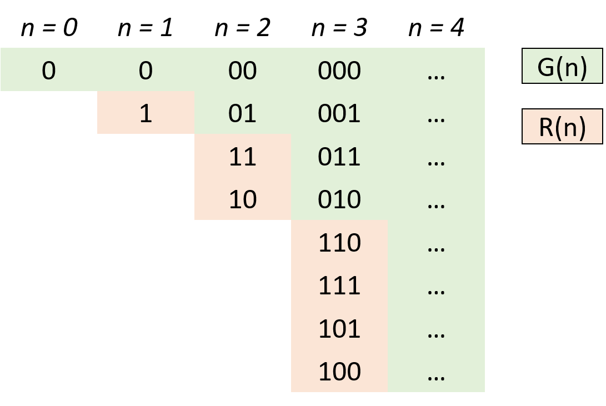

# [Medium][89. Gray Code](https://leetcode.com/problems/gray-code/)

The gray code is a binary numeral system where two successive values differ in only one bit.

Given a non-negative integer n representing the total number of bits in the code, print the sequence of gray code. A gray code sequence must begin with 0.

**Example 1:**

```text
Input: 2
Output: [0,1,3,2]
Explanation:
00 - 0
01 - 1
11 - 3
10 - 2

For a given n, a gray code sequence may not be uniquely defined.
For example, [0,2,3,1] is also a valid gray code sequence.

00 - 0
10 - 2
11 - 3
01 - 1
```

**Example 2:**

```text
Input: 0
Output: [0]
```

Explanation: We define the gray code sequence to begin with 0.
             A gray code sequence of n has size = 2n, which for n = 0 the size is 20 = 1.
             Therefore, for n = 0 the gray code sequence is [0].

## 思路 - 镜像反射法

关于**Gray Code**，在[百度百科](https://baike.baidu.com/item/%E6%A0%BC%E9%9B%B7%E7%A0%81)和[维基百科](https://zh.wikipedia.org/wiki/%E6%A0%BC%E9%9B%B7%E7%A0%81)上面都有解释。

数字0～7的编码比较如下：

n位元的格雷码可以从n-1位元的格雷码以上下镜射后加上新位元的方式快速的得到，如右图所示一般。


仔细观察一下，规律非常的明显。n的结果可以又 n - 1的结果的出来。在n - 1的结果集的基础上，高位全部置为1.

为了实现这个算法，需要有一个`int high`作为最高位的值。每次 `i + 1`的时候想左位移一次。然后，遍历`List<int> ans`已有的items，加上最高位的high即可。

## 代码 - 镜像反射法

```csharp
public class Solution {
    public IList<int> GrayCode(int n) {
        IList<int> ans = new List<int>();
        ans.Add(0);
        int high = 1;

        for(int i = 0; i < n; i++)
        {
            for(int j = ans.Count - 1; j >= 0; j--)
            {
                ans.Add(ans[j] + high);
            }
            high <<= 1;
        }
        return ans;
    }
}
```
