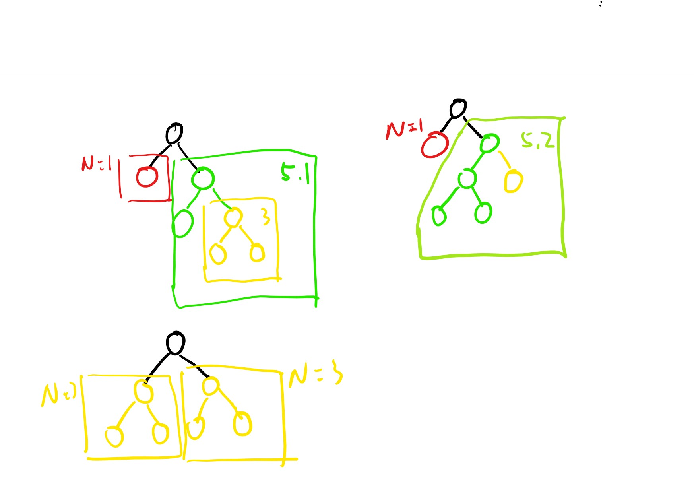

# 894. All Possible Full Binary Trees

A full binary tree is a binary tree where each node has exactly 0 or 2 children.

Return a list of all possible full binary trees with N nodes.  Each element of the answer is the root node of one possible tree.

Each node of each tree in the answer must have node.val = 0.

You may return the final list of trees in any order.

Example 1:

```text
Input: 7
Output: [[0,0,0,null,null,0,0,null,null,0,0],[0,0,0,null,null,0,0,0,0],[0,0,0,0,0,0,0],[0,0,0,0,0,null,null,null,null,0,0],[0,0,0,0,0,null,null,0,0]]
```

Explanation:


Note:

* 1 <= N <= 20

## 思路

这道题给了一个数字N，让我们生成所有包含N个结点的满二叉树。所谓的满二叉树，就是每个结点一定会有0个或2两个子结点，换句话说，子结点必须成对出现，注意跟完全二叉树区分。现在我们有N个结点可以使用，若我们仔细观察，可以发现，所有的满二叉树的结点总数都是奇数，**所以只要当N为偶数的时候，一定返回的是空数组**。下面我们就来考虑当N是奇数时，如何生成不同的满二叉树。先从最简单的开始，

当 N=1 时，就只有一个根结点，当 N=3 时，也只有一种情况，根结点和左右子结点。


当 N=5 时，就有如下两种情况。第一种情况可以看作是左侧带了N1，而右侧带了N3。第二种情况可以看作左侧带了N3，而右侧带了N1。


当 N=7 时，情况更为复杂。但细细分析下来，也无法是上述已经排列好的集中组合而已。N=7 可以分解成 :

```text
* Left = N1, Right = N5[1]  // 由于N5有2种可能性，当一侧为N5的时候，会有2种组合
* Left = N1, Right = N5[2]
* Left = N3, Right = N3     // N3的时候只有一种可能
* Left = N5[1], Right = N1  //跟第1，2种情况左右对称的方式
* Left = N5[2], Right = N1
```



此图省略4，5的情况。_请无视我的手工画_,,ԾㅂԾ,,

鉴于这种情况，用分值的思路，采用递归最为合适。为了避免每次都计算Nx的情况，使用一个Disctionary来暂时排好的TreeNode, 以N作为key.

## 代码 - 递归

```csharp
/**
 * Definition for a binary tree node.
 * public class TreeNode {
 *     public int val;
 *     public TreeNode left;
 *     public TreeNode right;
 *     public TreeNode(int x) { val = x; }
 * }
 */
public class Solution {
    private Dictionary<int, IList<TreeNode>> memo = new Dictionary<int, IList<TreeNode>>();
    public IList<TreeNode> AllPossibleFBT(int N) {
        IList<TreeNode> ano = new List<TreeNode>();
        if(!memo.ContainsKey(N))
        {
            if(N == 1)
            {
                ano.Add(new TreeNode(0));
            }
            else if(N % 2 == 1)
            {
                for(int i = 0; i < N; ++i)
                {
                    int j = N - 1 - i;

                    IList<TreeNode> lset = AllPossibleFBT(i);
                    IList<TreeNode> rset = AllPossibleFBT(j);

                    foreach(var lnode in lset)
                    {
                        foreach(var rnode in rset)
                        {
                            TreeNode bns = new TreeNode(0);
                            bns.left = lnode;
                            bns.right = rnode;
                            ano.Add(bns);
                        }
                    }
                }
            }

            memo.Add(N, ano);
        }

        return memo[N];

    }
}
```
