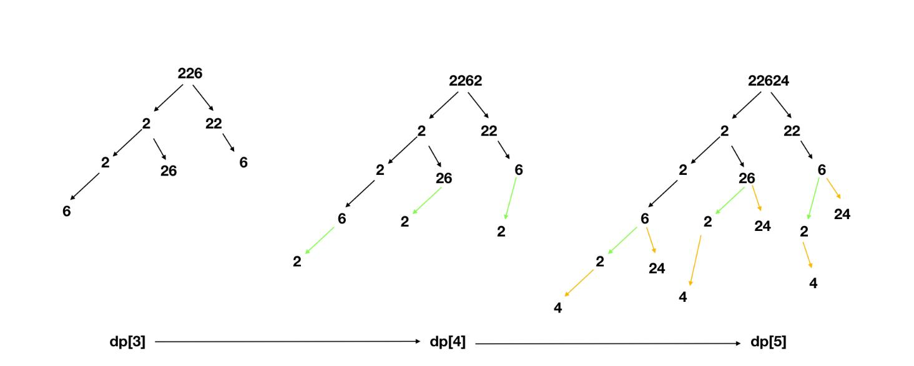

# [Medium][91. Decode Ways](https://leetcode.com/problems/decode-ways/)

A message containing letters from A-Z is being encoded to numbers using the following mapping:

> 'A' -> 1
> 'B' -> 2
> ...
> 'Z' -> 26

Given a non-empty string containing only digits, determine the total number of ways to decode it.

**Example 1:**

> Input: "12"
> Output: 2
> Explanation: It could be decoded as "AB" (1 2) or "L" (12).

**Example 2:**

> Input: "226"
> Output: 3
> Explanation: It could be decoded as "BZ" (2 26), "VF" (22 6), or "BBF" (2 2 6).

## [思路 - dp - 压缩空间](src/62.%20Unique%20Paths)

本题要求对输入的字符串进行解码。将数字`1 - 26`转换成 `A - Z`。所以这里有几个地方是要主要的 ：

1. s[0] 不能为`'0'`. 开头为'0'是不合法的编码。
2. 不能有连续2个'0', '00'也是不合法的编码。
3. 当'0'出现的时候，前面必须是`'1'`或者`'2'`. 即`'10'`或者`'20'`都是合法的，`'30'`,`'40'`等等是不合法的编码.

遇到不合法的情况就直接返回0了。

下面是dp的情况。由于编码有可能会走入分支。例如11可以有`AA`的情况，也可能有`K`的情况。当符合情况的条件出现时候，就会走入一个分支。条件如下：

1. 一位为1或者2的时候有可能出现分支。
2. s[i] == '1' 的时候，如果下一位有值，会进入分支。
3. s[i] == '2' 的时候，如果下一位有值，并且`s[i + 1] <= '6'`. 进入分支。
4. s[i + 1] = '0' 的时候，无法进入分支，要回退上一个计数。例如 ：11可以拆开2个分支，但是10只能作为一个单独的分支。

如果采用的是判断s[i]是否是符合上面的拆分条件，每次都要判断i+1是否越界。那么为了简单起见，采用判读s[i - 1]是否为'1' 或者 '2'。这样s[i - 1]是已经走过的部分，不回越界，省去了检查的过程。

综合下来dp的规则如下：

* 建立最优子结构。参考可以看[62. Unique Paths](src/62.%20Unique%20Paths)。用pre保存上一个结果，当前计算结果放在cur. 每次出现分支，必然会使得结果乘倍，即 cur += pre;
* 若 s[i] = '0', 那么如果 s[i-1] = '1' or '2', 则是合法的。但是需要回退到上一个结果即dp[i] = dp[i-2]; 否则是不合法，要直接返回0.
* 若 s[i-1] = '1', dp[i] = dp[i-1] + dp[i-2].
* 若 s[i-1] = '2' && `s[i] <= 6`, dp[i] = dp[i-1] + dp[i-2].

因为dp[i]与dp[i - 1]和dp[i - 2]有关，所以实际上用两个变量pre & cur代替dp[]。

图解 ：


算法复杂度 O(N)
空间复杂度 O(1)

## 代码 - dp - [压缩空间]

```csharp
public int NumDecodings(string s)
{
    if (s.Length == 0 || s[0] == '0') return 0;

    int pre = 1;
    int cur = 1;

    for (int i = 1; i < s.Length; i++)
    {
        int tmp = cur;
        if (s[i] == '0')
        {
            if (s[i - 1] == '1' || s[i - 1] == '2')
                cur = pre;
            else
                return 0;
        }
        else if (s[i - 1] == '1' || (s[i - 1] == '2' && s[i] <= '6'))
            cur += pre;
        pre = tmp;
    }
    return cur;
}
```
