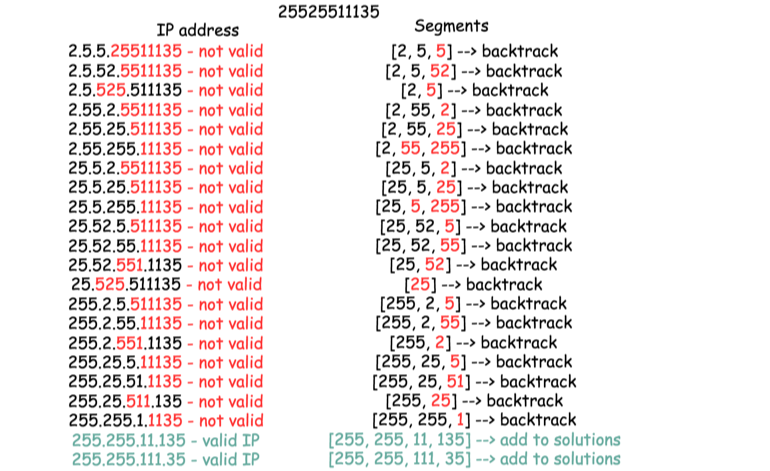

# [Medium][93. Restore IP Addresses](https://leetcode.com/problems/restore-ip-addresses/)

Given a string containing only digits, restore it by returning all possible valid IP address combinations.

Example:

> Input: "25525511135"
> Output: ["255.255.11.135", "255.255.111.35"]

## 思路 - 回溯

这题要求计算出合法的IPv4地址。IPv4地址的特点是分4段，每段不超过255.
采用回溯的方式一个一个的去试，如果条件符合了，那么输出到结果，反之则忽略。



上面是25525511135的输出过程。

为了判断每次选取的数字是否超过255，采用int的方式，方便判断。每段选取的值放在`List<int>`中，往下一层传送。回溯的特点是要恢复到上一次的状态，所以在添加完ip之后，调入下一层，然后还要将其删除。
采用int的时候有一个问题,两个0被认为是一个数字，其实是不合法的。例如`100111`,被分割为`100.1.1.1`是合法的。但是分割为`1.001.1.1`则不合法。原因在于`ip = ip * 10 + (s[i] - '0');`, 当`ip==0`的时候，会继续计算下去。为了避免这种情况，要去掉`00`这种组合，采用这句代码```if (i > pos && ip == 0) break;```。

复杂度分析 :

时间复杂度 : 如上文所述，需要检查的组合不多于27个。
空间复杂度 : 常数空间存储解，不多于19 个有效IP地址。


```csharp
    int ip = 0;
    for (int i = pos; i < pos + 3 && i < s.Length; i++)
    {
        if (i > pos && ip == 0) break;  // remove '00'
        ip = ip * 10 + (s[i] - '0');
        if (ip > 255) break;    // remove ip > 255

        res.Add(ip);
        RestoreIpAddressesBT(ans, res, s, i + 1, dot + 1);
        res.RemoveAt(res.Count - 1);
    }
```

因为IPv4分为4段，所以超过4段就没有必要继续下去。

```csharp
    if (dot == 4 && pos == s.Length)
    {
        StringBuilder sb = new StringBuilder();
        for (int i = 0; i < res.Count; i++)
        {
            sb.Append(res[i]);
            sb.Append('.');
        }
        string r = sb.Remove(sb.Length - 1, 1).ToString();
        if (!ans.Contains(r))
            ans.Add(r);
        return;
    }
    else if (dot == 4) return;  // exit is dot >= 4
```

## 代码 - 回溯

```csharp
public class Solution {
    public IList<string> RestoreIpAddresses(string s)
    {
        IList<string> ans = new List<string>();
        RestoreIpAddressesBT(ans, new List<int>(), s, 0, 0);

        return ans;
    }

    private void RestoreIpAddressesBT(IList<string> ans, List<int> res, string s,  int pos, int dot)
    {
        if (dot == 4 && pos == s.Length)
        {
            StringBuilder sb = new StringBuilder();
            for (int i = 0; i < res.Count; i++)
            {
                sb.Append(res[i]);
                sb.Append('.');
            }
            string r = sb.Remove(sb.Length - 1, 1).ToString();
            if (!ans.Contains(r))
                ans.Add(r);
            return;
        }
        else if (dot == 4) return;
        else
        {
            int ip = 0;
            for (int i = pos; i < pos + 3 && i < s.Length; i++)
            {
                if (i > pos && ip == 0) break;
                ip = ip * 10 + (s[i] - '0');
                if (ip > 255) break;

                res.Add(ip);
                RestoreIpAddressesBT(ans, res, s, i + 1, dot + 1);
                res.RemoveAt(res.Count - 1);
            }
        }
    }
}
```
