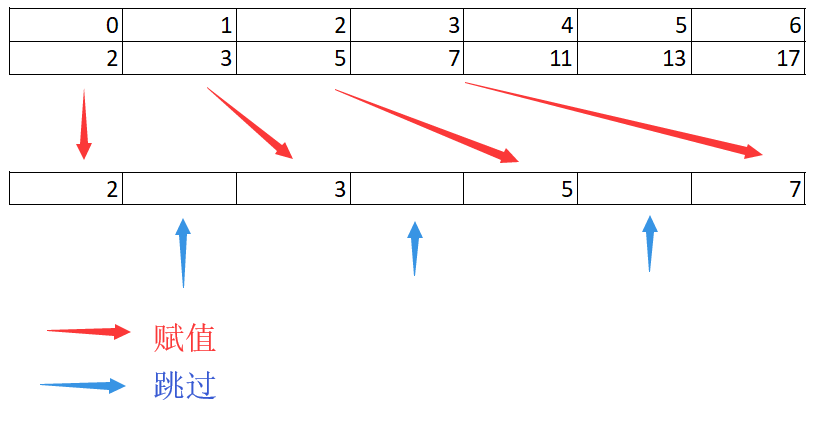
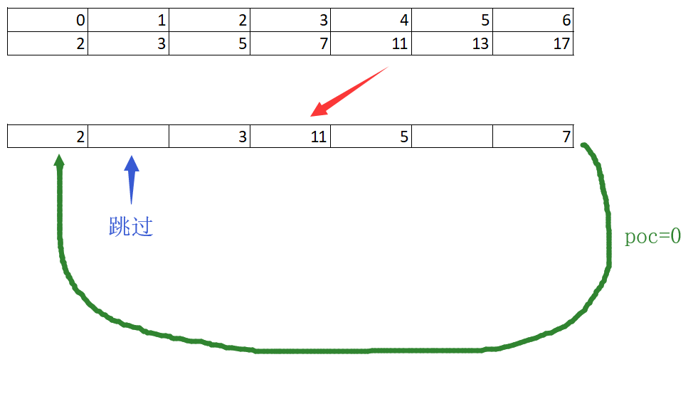
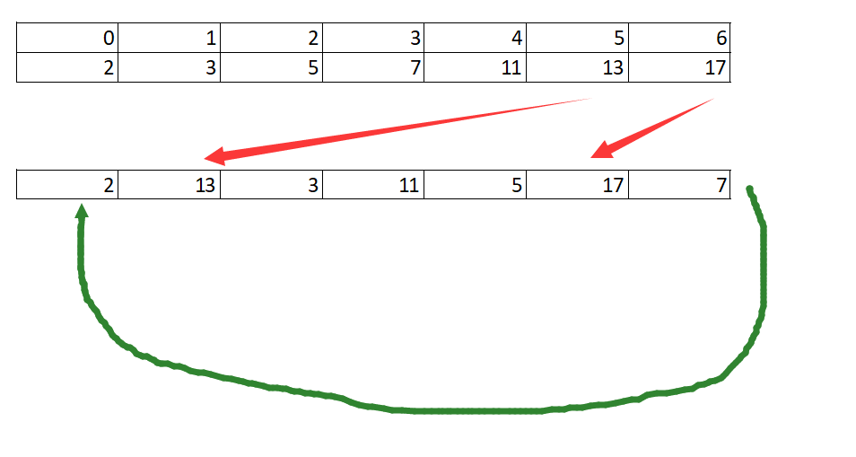

# 950. Reveal Cards In Increasing Order

In a deck of cards, every card has a unique integer.  You can order the deck in any order you want.

Initially, all the cards start face down (unrevealed) in one deck.

Now, you do the following steps repeatedly, until all cards are revealed:

1. Take the top card of the deck, reveal it, and take it out of the deck.
2. If there are still cards in the deck, put the next top card of the deck at the bottom of the deck.
3. If there are still unrevealed cards, go back to step 1.  Otherwise, stop.

Return an ordering of the deck that would reveal the cards in increasing order.

The first entry in the answer is considered to be the top of the deck.

Example 1:

```text
Input: [17,13,11,2,3,5,7]
Output: [2,13,3,11,5,17,7]
Explanation:
We get the deck in the order [17,13,11,2,3,5,7] (this order doesn't matter), and reorder it.
After reordering, the deck starts as [2,13,3,11,5,17,7], where 2 is the top of the deck.
We reveal **2**, and move 13 to the bottom.  The deck is now [3,11,5,17,7,13].
We reveal **3**, and move 11 to the bottom.  The deck is now [5,17,7,13,11].
We reveal **5**, and move 17 to the bottom.  The deck is now [7,13,11,17].
We reveal **7**, and move 13 to the bottom.  The deck is now [11,17,13].
We reveal **11**, and move 17 to the bottom.  The deck is now [13,17].
We reveal **13**, and move 17 to the bottom.  The deck is now [17].
We reveal **17**.
Since all the cards revealed are in increasing order, the answer is correct.
```

Note:

1. 1 <= A.length <= 1000
2. 1 <= A[i] <= 10^6
3. A[i] != A[j] for all i != j

## 思路

这是一个翻牌的有些。先把第一张拿掉，然后把第二张放到队尾，再拿掉第三张，第四张翻到队尾。以此类推。直到倒数第二张被拿掉，直接拿掉最后一张。这样翻过之后，拿掉的牌按照大小排列是有序的。

例如上面的抽调牌的顺序依次是[2,3,5,7,11,13,17] 是有序的。输出的数组是能够得到这个结果的数组。

由于输入的数组顺序是不定的，所有要先将输入数组进行排序。例如将[17,13,11,2,3,5,7]，排序为[2,3,5,7,11,13,17]，使其有序。

利用一个辅助数组，模拟这个翻牌的过程，用来构造所需要的一个数组。

观察这个翻牌的过程可以发现，第一次输出的顺序是可以预见的。分别是A[0], A[1],A[3],...,A[2n-1].可以排定这些数字。有序数组A按照顺序先将第一个元素放在待输出数组B的第一个位置上。接下来A移到下一个元素，而数组B则需要先跳过第二个元素，然后停再第三个元素上，将A的元素放入。这个行为持续到排满一半的元素以后，B已经来到了数组的末尾。



这个时候开始第二轮的输出。第一轮的时候，当2被拿掉的时候，被移到队尾的[13]这个时候已经重新回到了队列的前方，将要被拿掉。这个时候把B想象成一个环形链表。移动到队尾之后，重新回到0的位置，先判断一下是否没有被占用。如果被占用，挪到下一个元素，直到第一个没有被占用的元素，再重复上述的过程。判断是否要跳过一个元素，还是要对这个位置赋值。



然后再次重复这个过程，直到分配到倒数第二个元素完成。这个时候只剩下一个空余的位置，没有填满，这个时候可以直接填充这个位置即可。



## 代码

```csharp
public class Solution {
    public int[] DeckRevealedIncreasing(int[] deck) {

        if(deck.Length == 0 || deck.Length == 1) return deck;

        int len = deck.Length;
        int[] reveal = InitArray(len);
        Array.Sort(deck);
        bool skip = false;

        int pos = 0;

        for(int i = 0; i < len - 1; i++)
        {
            while(skip)
            {
                pos = MoveToNext(reveal, pos);
                skip = false;
            }

            reveal[pos] = deck[i];
            skip = true;
            pos = MoveToNext(reveal, pos);
        }
        reveal[pos] = deck[len - 1];

        return reveal;

    }

    private int[] InitArray(int len)
    {
        int[] reveal = new int[len];

        for(int i = 0; i < len; i++)
        {
            reveal[i] = Int32.MinValue;
        }

        return reveal;
    }
    private int MoveToNext(int[] reveal, int pos)
    {
        while(true)
        {
            if(pos == reveal.Length - 1)
                pos = 0;
            else
                pos += 1;
            if(reveal[pos] == int.MinValue) break;
        }
        return pos;
    }
}
```
