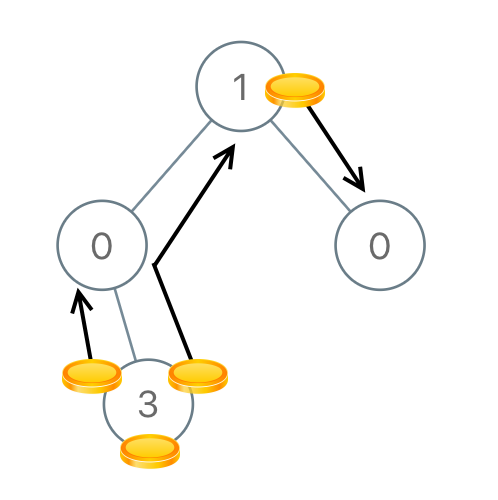

# [979. Distribute Coins in Binary Tree](https://leetcode.com/problems/distribute-coins-in-binary-tree/)

Given the root of a binary tree with N nodes, each node in the tree has node.val coins, and there are N coins total.

In one move, we may choose two adjacent nodes and move one coin from one node to another.  (The move may be from parent to child, or from child to parent.)

Return the number of moves required to make every node have exactly one coin.

**Example 1:**


```text
Input: [3,0,0]
Output: 2
Explanation: From the root of the tree, we move one coin to its left child, and one coin to its right child.
```

**Example 2:**


```text
Input: [0,3,0]
Output: 3
Explanation: From the left child of the root, we move two coins to the root [taking two moves].  Then, we move one coin from the root of the tree to the right child.
```

**Example 3:**


```text
Input: [1,0,2]
Output: 2
```

**Example 4:**



```text
1<= N <= 100
0 <= node.val <= N
```

## 思路 - dfs

这一题的要求是运送Node上的金币。每次移动一个金币，只能向相邻的节点移动，即子节点或者父节点。要计算最小的移动次数。

一开始的想法，想要知道金币最多的节点，需要运送金币的节点，然后再进行计算如何运送。仔细想想比较麻烦。需要保存运出金币的节点和运入节点，想要将tree转化成数组，然后借鉴tree的数组表达方式。这种方式显然太过复杂。

凡事太过复杂，一定路子不对。往简单点想，既然是tree的题目，应该跟树的遍历有关。如果把目光放在树的遍历上又会如何。用后续遍历的方式，先走到最低的叶子节点。这里有3种情况 ：

1. val = 1, 不需要运送金币，move为0.
2. val > 1, 需要往parent 运送 val - 1个金币， move = val - 1.
3. val = 0, 需要parent 运送 1 个金币, move = 1.

合并 2，3的情况，可以为 move = Math.Abs(node.val - 1). 当金币运送到中间节点后，进行同样的计算，继续往上送，直到根节点，完成。

## 代码 - dfs

```csharp
/**
 * Definition for a binary tree node.
 * public class TreeNode {
 *     public int val;
 *     public TreeNode left;
 *     public TreeNode right;
 *     public TreeNode(int x) { val = x; }
 * }
 */
public class Solution {
    private int ans = 0;
    public int DistributeCoins(TreeNode root) {

        dfs(root);
        return ans;
    }

    private int dfs(TreeNode node)
    {
        if(node == null) return 0;

        int left = dfs(node.left);
        int right = dfs(node.right);

        ans += Math.Abs(left) + Math.Abs(right);

        return node.val + left + right - 1;
    }
}
```
