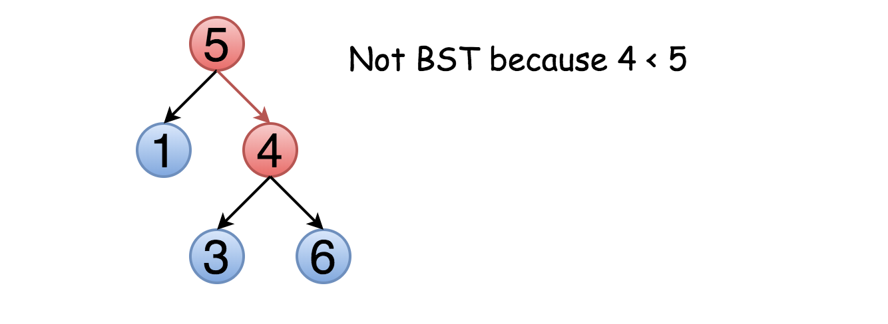
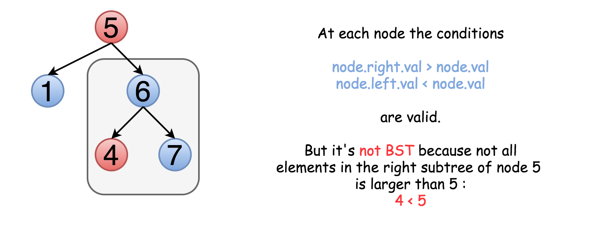

# [Medium][98. Validate Binary Search Tree](https://leetcode.com/problems/validate-binary-search-tree/)

Given a binary tree, determine if it is a valid binary search tree (BST).

Assume a BST is defined as follows:

The left subtree of a node contains only nodes with keys less than the node's key.
The right subtree of a node contains only nodes with keys greater than the node's key.
Both the left and right subtrees must also be binary search trees.

**Example 1:**

```text
    2
   / \
  1   3

Input: [2,1,3]
Output: true
```

**Example 2:**

```text
    5
   / \
  1   4
     / \
    3   6

Input: [5,1,4,null,null,3,6]
Output: false
Explanation: The root node's value is 5 but its right child's value is 4.
```

## 思路 - 比较边界值

乍一看，这是一个平凡的问题。只需要遍历整棵树，检查 node.right.val > node.val 和 node.left.val < node.val 对每个结点是否成立。



问题是，这种方法并不总是正确。不仅右子结点要大于该节点，整个右子树的元素都应该大于该节点。例如:



这意味着我们需要在遍历树的同时保留结点的上界与下界，在比较时不仅比较子结点的值，也要与上下界比较。即 `node.val > Max(node.left.val)`, `node.val < Min(node.right.val)`

首先走到最左侧，拿到最小值，然后走右侧，比较左右两边的大小，检查是否有序。将整个子树的最小值和最大值向上返回。每一层都要比较`node.val > Max(node.left.val)`, `node.val < Min(node.right.val)`, `Max(node.left.val) < Min(node.right.val)` 是否成立。

时间复杂度 ：O(N) 遍历整棵树
空间复杂度 ：O(N), 没有使用额外的变量，但是使用递归是借助了线程的stack, 所有为O(N)

## 代码 - 比较边界值

```csharp
/**
 * Definition for a binary tree node.
 * public class TreeNode {
 *     public int val;
 *     public TreeNode left;
 *     public TreeNode right;
 *     public TreeNode(int x) { val = x; }
 * }
 */
public class Solution {
    public bool IsValidBST(TreeNode root)
    {
        if (root == null || (root.left == null && root.right == null)) return true;
        int min = 0, max = 0;
        bool ans = helper(root, ref min, ref max);
        return ans;
    }

    private bool helper(TreeNode root, ref int min, ref int max)
    {
        if (root.left == null && root.right == null)
        {
            min = max = root.val;
            return true;
        }

        bool ans = false;

        int lMin = root.val, lMax = root.val;

        if (root.left != null)
        {
            ans = helper(root.left, ref lMin, ref lMax);
            if (!ans || root.val <= lMax) return false;
        }

        int rMin = root.val, rMax = root.val;
        if (root.right != null)
        {
            ans = helper(root.right, ref rMin, ref rMax);
            if (!ans || root.val >= rMin) return false;
        }

        if (lMax >= rMin)
        {
            return false;
        }

        min = lMin;
        max = rMax;

        return true;
    }
}
```

## 思路 - 中序遍历 + 有序数组

BST 本身就是有序，我们可以通过中序遍历将他的值转化成为一个有序的数组。例如下面的树，经过中序遍历生成的数组是一个有序数组。反之，如果中序遍历生成的数组不是有序的，那么BST不成立。

```text
    5
   / \
  1   4
     / \
    3   6

[1,5,3,4,6]
```

时间复杂度: O(2N) = O(N) , 遍历一棵树O(N), 再遍历一次`List<int>`为O(N)
空间复杂度：O(2N) = O(N), 记录所有值的`List<int>`, 递归使用了线程的stack

## 代码 - 中序遍历 + 有序数组

```csharp
/**
 * Definition for a binary tree node.
 * public class TreeNode {
 *     public int val;
 *     public TreeNode left;
 *     public TreeNode right;
 *     public TreeNode(int x) { val = x; }
 * }
 */
public class Solution {
    public bool IsValidBST(TreeNode root)
    {
        List<int> ans = new List<int>();
        helper(ans, root);

        for(int i = 1; i < ans.Count; i++)
        {
            if(ans[i - 1] >= ans[i]) return false;
        }
        return true;
    }

    private void helper(List<int> ans, TreeNode root)
    {
        if(root == null) return;
        if(root.left != null)
            helper(ans, root.left);

        ans.Add(root.val);

        if(root.right != null)
            helper(ans,root.right);
    }
}
```
