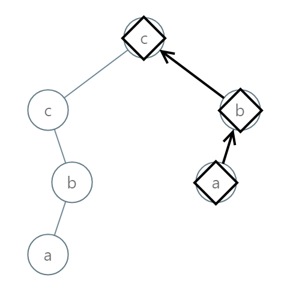

# [Medium][988. Smallest String Starting From Leaf](https://leetcode.com/problems/smallest-string-starting-from-leaf/)

Given the root of a binary tree, each node has a value from 0 to 25 representing the letters 'a' to 'z': a value of 0 represents 'a', a value of 1 represents 'b', and so on.

Find the lexicographically smallest string that starts at a leaf of this tree and ends at the root.

(As a reminder, any shorter prefix of a string is lexicographically smaller: for example, "ab" is lexicographically smaller than "aba".  A leaf of a node is a node that has no children.)

**Example 1:


> Input: [0,1,2,3,4,3,4]
> Output: "dba"

**Example 2:**


Input: [25,1,3,1,3,0,2]
Output: "adz"

**Example 3:**


Input: [2,2,1,null,1,0,null,0]
Output: "abc"

Note:

The number of nodes in the given tree will be between 1 and 8500.
Each node in the tree will have a value between 0 and 25.

## 思路 - 先序遍历

这道题跟[129. 求根到叶子节点数字之和](src/129.%20Sum%20Root%20to%20Leaf%20Numbers)很类似。拼接string的方式是要叶子节点的`char`在最高位，根节点的在最低位。遍历的步骤为:

1. 传入一个`List<char>`，代表着已经扫描过的节点中的val。
2. 如果是空节点直接返回。
3. 将当前的val转换成字符，并且插入到最高位。
   `chs.Insert(0, (char)('a' + root.val));`
4. 如果已经是叶子节点则比较是否是最小的情况。
5. 分别检查左右子树是否为空，如果不为空则递归调用。
6. 最后要从`List<char>`中删除当前节点的值。

在整个递归的过程中，`List<char>`传递的是一个引用，每一次递归调用都会在同一个对象中更新和使用当前值。所以要在递归调用退出之前还原回最初的值，否则状态就回不对。

对于Min的比较，首先是从高位逐位比较字符的大小，如果遇到较小的字符，则返回它所在的数组。如果每个字符都相等，就要比较字符串的长度，返回较短的是字符串。如果两串都相等，返回哪一个都无所谓了。例如：

* `abc`和`abcd`比较，前面3个字符都一样，那么就是较短的`abc`较小.
* `abcd`和`ac`比较，虽然`ac`较短，但是第二个字符`b`和`c`，相比，`b`要小，所以返回`abcd`.

时间复杂度：O(NlogN). 先序遍历，每个节点都会遍历一遍O(N).当走到叶子节点的时候，需要比较2个`char[]`，`char[]`的长度又与路径上经过的节点数有关系，O(logN).`List<char>`的插入和删除为O(1). `O(N * logN * 1)`.
空间复杂度：O(N).

## 代码 - 先序遍历

```csharp
/**
 * Definition for a binary tree node.
 * public class TreeNode {
 *     public int val;
 *     public TreeNode left;
 *     public TreeNode right;
 *     public TreeNode(int x) { val = x; }
 * }
 */
public class Solution {
    char[] ans;
    public string SmallestFromLeaf(TreeNode root) {
        SmallestFromLeaf(root, new List<char>());
        return new string(ans);
    }

    private void SmallestFromLeaf(TreeNode root, List<char> chs)
    {
        if(root == null) return;
        chs.Insert(0, (char)('a' + root.val));
        if(root.left == null && root.right == null)
        {
            if(ans == null) ans = chs.ToArray();
            else
            {
                ans = Min(ans, chs.ToArray());
            }
        }
        else
        {
            SmallestFromLeaf(root.left, chs);
            SmallestFromLeaf(root.right, chs);
        }
        chs.RemoveAt(0);
    }

    private char[] Min(char[] x, char[] y)
    {
        for(int i = 0;i < x.Length && i < y.Length; i++)
        {
            if(x[i] == y[i]) continue;
            if(x[i] < y[i]) return x;
            else return y;
        }
        if(x.Length <= y.Length) return x;
        else return y;
    }
}
```
